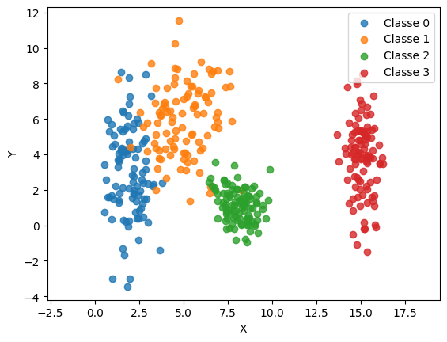
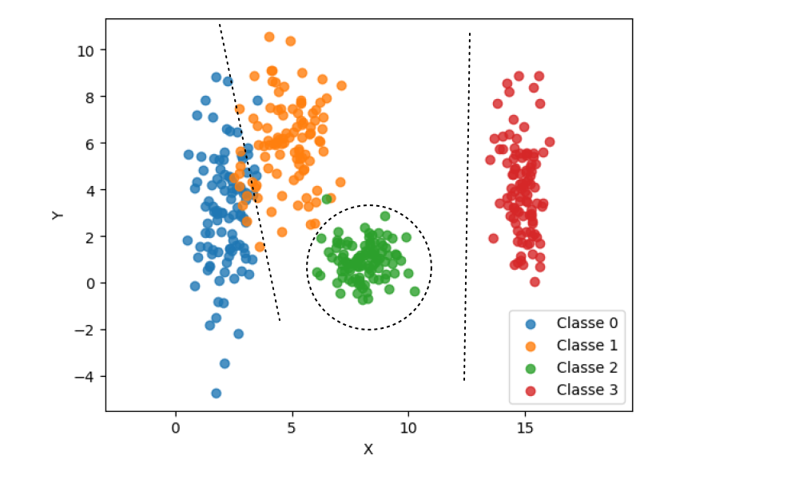
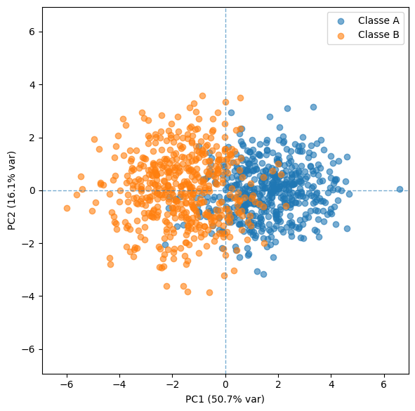
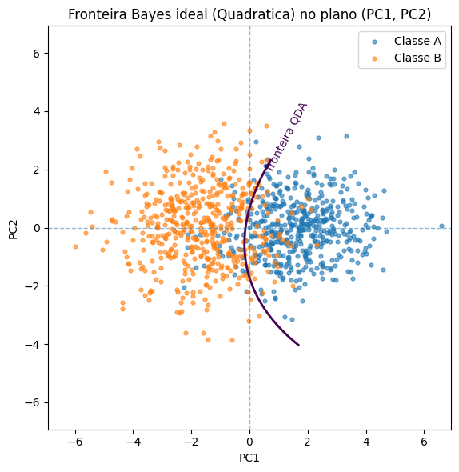
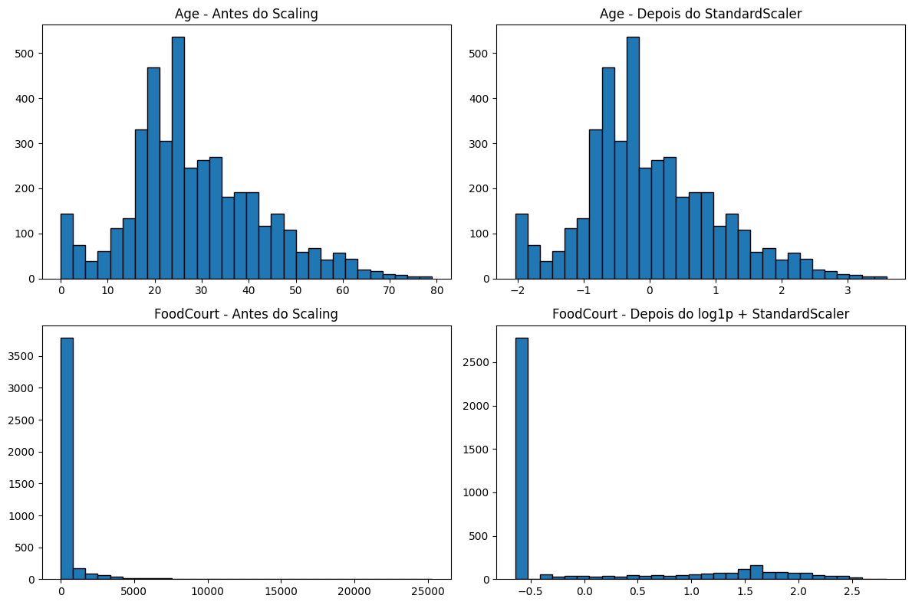

# Activity: Data Preparation and Analysis for Neural Networks


```python
import numpy as np
import matplotlib.pyplot as plt

```

# Exercise 1

## Exploring Class Separability in 2D

Understanding how data is distributed is the first step before designing a network architecture.  
In this exercise, you will generate and visualize a two-dimensional dataset to explore how data distribution affects the complexity of the decision boundaries a neural network would need to learn.

### Instructions

1. **Generate the Data:**  
   Create a synthetic dataset with a total of 400 samples, divided equally among 4 classes (100 samples each). Use a Gaussian distribution to generate the points for each class based on the following parameters:

   - **Class 0:** Mean = [2, 3], Standard Deviation = [0.8, 2.5]  
   - **Class 1:** Mean = [5, 6], Standard Deviation = [1.2, 1.9]  
   - **Class 2:** Mean = [8, 1], Standard Deviation = [0.9, 0.9]  
   - **Class 3:** Mean = [15, 4], Standard Deviation = [0.5, 2.0]  

2. **Plot the Data:**  
   Create a 2D scatter plot showing all the data points. Use a different color for each class to make them distinguishable.


```python

samples = 100

# ------------------------
# Classe 0
X0 = np.random.normal(2, 0.8, samples)
Y0 = np.random.normal(3, 2.5, samples)
# ------------------------

# Classe 1
X1 = np.random.normal(5, 1.2, samples)
Y1 = np.random.normal(6, 1.9, samples)

# ------------------------

# Classe 2
X2 = np.random.normal(8, 0.9, samples)
Y2 = np.random.normal(1, 0.9, samples)

# ------------------------

# Classe 3
X3 = np.random.normal(15, 0.5, samples)
Y3 = np.random.normal(4, 2.0, samples)

# ------------------------

# separa x e y

# visualização
plt.scatter(X0, Y0, alpha=0.8, label="Classe 0")
plt.scatter(X1, Y1, alpha=0.8, label="Classe 1")
plt.scatter(X2, Y2, alpha=0.8, label="Classe 2")
plt.scatter(X3, Y3, alpha=0.8, label="Classe 3")
plt.xlabel("X")
plt.ylabel("Y")
plt.axis("equal")
plt.legend()
plt.show()

```


    

    


---

3. **Analyze and Draw Boundaries:**
   a. Examine the scatter plot carefully. Describe the distribution and overlap of the four classes.  
   b. Based on your visual inspection, could a simple, linear boundary separate all classes?  
   c. On your plot, sketch the decision boundaries that you think a trained neural network might learn to separate these classes.  

---

Respostas:

**A.** No gráfico plotado acima, é possível visualizarmos as diferentes distribuições entre as 4 classes, conforme foi especificado durante a montagem de cada eixo. Podemos destacar que a classe 0 e 3 apresentam pequenas variâncias no eixo X e altas variâncias no eixo Y o que lhes confere uma aparência mais alongada verticalmente. A classe 1, possui variâncias mais próximas nos dois eixos, ainda assim é mais distribuida ao longo do eixo Y. A classe 2 por fim, possui a mesma variância para os dois eixos, por isso possui uma aparência de estar distribuida de forma mais circular. 

Em relação ao overlap, as classes 0 e 1 possuem o maior overlap. Em alguns casos, a classe 2 possui overlap com a classe 1. Já a classe 3 é a que fica mais distante das demais e não possui overlap com outras classes.

**B.** Uma linha de decisão linear sozinha não seria capaz de dividir as 4 classes de uma vez só.

**C.** :




---

# Exercise 2

## Non-Linearity in Higher Dimensions

Simple neural networks (like a Perceptron) can only learn linear boundaries. Deep networks excel when data is not linearly separable. This exercise challenges you to create and visualize such a dataset.

### Instructions

1. **Generate the Data:**  
   Create a dataset with 500 samples for Class A and 500 samples for Class B. Use a multivariate normal distribution with the following parameters:

   - **Class A:**  
     Mean vector:  
     $$
     \mu_A = [0, 0, 0, 0, 0]\
     $$  

     Covariance matrix:  
     $$
     \Sigma_A =
     \begin{pmatrix}
     1.0 & 0.8 & 0.1 & 0.0 & 0.0 \\
     0.8 & 1.0 & 0.3 & 0.0 & 0.0 \\
     0.1 & 0.3 & 1.0 & 0.5 & 0.0 \\
     0.0 & 0.0 & 0.5 & 1.0 & 0.2 \\
     0.0 & 0.0 & 0.0 & 0.2 & 1.0
     \end{pmatrix}
     $$

   - **Class B:**  
     Mean vector:  
     $$
     \mu_B = [1.5, 1.5, 1.5, 1.5, 1.5]
     $$

     Covariance matrix:  
     $$
     \Sigma_B =
     \begin{pmatrix}
     1.5 & -0.7 & 0.2 & 0.0 & 0.0 \\
     -0.7 & 1.5 & 0.4 & 0.0 & 0.0 \\
     0.2 & 0.4 & 1.5 & 0.6 & 0.0 \\
     0.0 & 0.0 & 0.6 & 1.5 & 0.3 \\
     0.0 & 0.0 & 0.0 & 0.3 & 1.5
     \end{pmatrix}
     $$

---


```python
import numpy as np

samples = 500

# Class A --------------
# média (vetor de 5 elementos) temos 5 dimensões
mean_A = [0, 0, 0, 0, 0]

# matriz de covariância (5x5) - variancias (= desvio²) ficam na diag principal. Fora da diagonal → estão as covariâncias entre pares de variáveis (por isso matriz 5x5)                                                                     
cov_A = [
    [1.0, 0.8, 0.1, 0.0, 0.0],
    [0.8, 1.0, 0.3, 0.0, 0.0],  
    [0.1, 0.3, 1.0, 0.5, 0.0],
    [0.0, 0.0, 0.5, 1.0, 0.2],
    [0.0, 0.0, 0.0, 0.2, 1.0]
]

# gera os dados
A = np.random.multivariate_normal(mean_A, cov_A, samples)
# -----------------------

# Class B --------------
# média (vetor de 5 elementos)
mean_B = [1.5, 1.5, 1.5, 1.5, 1.5]

# matriz de covariância (5x5)
cov_B = [
    [1.5, -0.7, 0.2, 0.0, 0.0],
    [-0.7, 1.5, 0.4, 0.0, 0.0],
    [0.2, 0.4, 1.5, 0.6, 0.0],
    [0.0, 0.0, 0.6, 1.5, 0.3],
    [0.0, 0.0, 0.0, 0.3, 1.5]
]


# gera os dados
B = np.random.multivariate_normal(mean_B, cov_B, samples)
# -----------------------


# Juntando Classe A e Classe B
X = np.vstack([A, B])                 # (1000, 5)
y = np.r_[np.zeros(samples), np.ones(samples)].astype(int)  # 0=A, 1=B

```

---

2. **Visualize the Data:**  
   Since you cannot directly plot a 5D graph, you must reduce its dimensionality.
   - Use a technique like **Principal Component Analysis (PCA)** to project the 5D data down to 2 dimensions.  
   - Create a scatter plot of this 2D representation, coloring the points by their class (A or B).

---


```python
# Passo 1 do PCA
# Centralizando os dados
mu = X.mean(axis=0)    # média percorre as linhas (amostras), calcula uma média por coluna.
Xc = X - mu            # centralizado -> cada coluna com média ~ 0

print(Xc.mean(axis=0))  # deve dar algo muito próximo de [0, 0, 0, 0, 0]
print(X.shape, Xc.shape)  # ambos (1000, 5)

```

    [-1.35713663e-15 -9.94759830e-17  6.21724894e-16  1.26632038e-15
     -1.93622895e-16]
    (1000, 5) (1000, 5)


```python
# Passo 2
# Xc vem do passo de centralização
n, d = Xc.shape

# 1) SVD do dado centralizado
U, S, Vt = np.linalg.svd(Xc, full_matrices=False)

# 2) Componentes principais
components = Vt         # shape (d, d); cada linha é um PC (PC1 = components[0], etc.)

# 3) Variâncias explicadas (autovalores da covariância)
explained_variance = (S**2) / (n - 1)           # shape (d,)

# 4) Proporção da variância explicada (EVR)
explained_variance_ratio = explained_variance / explained_variance.sum()

# 5) Inspeções rápidas
print("Variancia por componente:", explained_variance_ratio)
print("Variancia acumulada     :", np.cumsum(explained_variance_ratio))
print("Shape PCs (Vt):", Vt.shape)
print("PC1 (primeira linha de Vt):", components[0])

```

    Variancia por componente: [0.50660312 0.16080371 0.15028523 0.12188206 0.06042589]
    Variancia acumulada     : [0.50660312 0.66740683 0.81769206 0.93957411 1.        ]
    Shape PCs (Vt): (5, 5)
    PC1 (primeira linha de Vt): [-0.40287121 -0.44481315 -0.49783545 -0.49087104 -0.38864062]


Podemos ver pela linha 'EVR por componente' que o PC1 representa 51% da variância, já o PC2 15%, seguidos por 14%, 12% e 6%.

Na linha 'EVR acumulada' podemos ver a soma dos PCs e identificar que teremos 66% da variância explicada ao reduzirmos a dimensionalidade para de 5 → 2.

Em 'PC1 (primeira linha de Vt)' temos o peso de cada uma das 5 features no PC1.


```python
# Passo 3, reduzindo a dimensão para k=2

k = 2
W = components[:k, :]        # (2,5) -> PC1 e PC2 empilhados em linhas
Z = Xc @ W.T                 # (n_amostras, 2) -> projeção 2D (PC1, PC2)

print("Z shape:", Z.shape)   # esperado: (1000, 2)
print("EVR k=2:", explained_variance_ratio[:2].sum())  # ~ 0.666...

```

    Z shape: (1000, 2)
    EVR k=2: 0.6674068299987173


```python
# Passo 4 — Visualizar por classe
import matplotlib.pyplot as plt

labels = np.r_[np.zeros(samples), np.ones(samples)].astype(int)  # 0=A, 1=B

plt.figure(figsize=(6,6))
plt.scatter(Z[labels==0, 0], Z[labels==0, 1], alpha=0.6, label="Classe A")
plt.scatter(Z[labels==1, 0], Z[labels==1, 1], alpha=0.6, label="Classe B")
plt.xlabel(f"PC1 ({explained_variance_ratio[0]*100:.1f}% var)")
plt.ylabel(f"PC2 ({explained_variance_ratio[1]*100:.1f}% var)")
plt.legend()

# --- iguala escala e limites ---
ax = plt.gca()
ax.set_aspect('equal', adjustable='box')        # 1 unidade em x = 1 unidade em y
lim = np.max(np.abs(Z[:, :2])) * 1.05           # pega a maior “amplitude” em qualquer eixo
ax.set_xlim(-lim, lim)
ax.set_ylim(-lim, lim)

# (opcional) eixos no zero
plt.axhline(0, lw=1, ls='--', alpha=0.6)
plt.axvline(0, lw=1, ls='--', alpha=0.6)

plt.tight_layout()
plt.show()

```


    

    


```python
# Checagem final
# 1) média das colunas após centralizar deve ser bem próxima de 0
print("média(Xc) :", Xc.mean(axis=0))

# 2) PCs ortonormais: Vt @ Vt.T ≈ identidade. Diag principal com 1, fora da diag com 0.
I = components @ components.T
print("ortogonalidade PCs (VtVt^T):\n", I)

# 3) variância explicada de k=2 deve somar ~0.666...
print("EVR k=2:", explained_variance_ratio[:2].sum())

# 4) no espaço dos PCs, as dimensões ficam ~descorrelacionadas (covariância ~diagonal)
import numpy as np
Z = Xc @ components[:2, :].T
print("cov(Z):\n", np.cov(Z, rowvar=False))

```

    média(Xc) : [-1.35713663e-15 -9.94759830e-17  6.21724894e-16  1.26632038e-15
     -1.93622895e-16]
    ortogonalidade PCs (VtVt^T):
     [[ 1.00000000e+00 -3.12710893e-17 -4.30442730e-16  6.78280298e-17
      -1.84493768e-17]
     [-3.12710893e-17  1.00000000e+00 -1.11869637e-16  1.94667778e-16
      -1.89386929e-16]
     [-4.30442730e-16 -1.11869637e-16  1.00000000e+00 -6.21323413e-16
       2.08926145e-16]
     [ 6.78280298e-17  1.94667778e-16 -6.21323413e-16  1.00000000e+00
      -5.62481003e-16]
     [-1.84493768e-17 -1.89386929e-16  2.08926145e-16 -5.62481003e-16
       1.00000000e+00]]
    EVR k=2: 0.6674068299987173
    cov(Z):
     [[ 4.53192941e+00 -1.80036166e-16]
     [-1.80036166e-16  1.43850491e+00]]


---

3. **Analyze the Plots:** 

   **a.** Based on your 2D projection, describe the relationship between the two classes.  

   **b.** Discuss the **linear separability** of the data. Explain why this type of data structure poses a challenge for simple linear models and would likely require a multi-layer neural network with non-linear activation functions to be classified accurately.  

---

**a.**: Na projeção 2D (PC1×PC2), as duas classes formam nuvens elípticas parcialmente sobrepostas. A separação principal ocorre ao longo do PC1, que desloca A para valores negativos e B para positivos. Pelo PC2 há pouca separação, as classes se misturam nessa direção. A classe B apresenta maior dispersão.

**b.**: Os dados não são linearmente separáveis. Uma reta (como PC1=0) já separa parte dos pontos, mas há bastante sobreposição. Como as classes têm covariâncias diferentes, a fronteira Bayes ótima seria a quadrática, não linear. Modelos lineares não conseguem capturar essa curvatura; por isso, uma MLP com ativações não lineares (ou QDA/Kernel SVM) é mais adequada para classificar com precisão.

#### Conclusão: O que o PCA nos trouxe de informação então?
O PCA nos deu a “câmera certa” para olhar o dataset: mostrou que a diferença entre as classes está sobretudo numa única direção (PC1), quantificou o quanto dessa história aparece em 2D (~66,7%), descorrelacionou os eixos para leitura clara e revelou como cada variável contribui para esses eixos.


```python
import numpy as np
import matplotlib.pyplot as plt

# Z: (n,2) com [PC1, PC2]
# labels: (n,) com 0 (A) e 1 (B)
Z_A = Z[labels==0]
Z_B = Z[labels==1]

# parâmetros gaussianos no espaço 2D dos PCs
muA = Z_A.mean(axis=0)
muB = Z_B.mean(axis=0)
SigmaA = np.cov(Z_A, rowvar=False)
SigmaB = np.cov(Z_B, rowvar=False)

invA = np.linalg.inv(SigmaA)
invB = np.linalg.inv(SigmaB)
logdetA = np.linalg.slogdet(SigmaA)[1]
logdetB = np.linalg.slogdet(SigmaB)[1]

def log_like(x, mu, inv, logdet):
    c = x - mu
    return -0.5 * (np.einsum('...i,ij,...j', c, inv, c) + logdet)

# grade para o contorno
pad = 0.2
x1 = np.linspace(Z[:,0].min() - pad, Z[:,0].max() + pad, 400)
x2 = np.linspace(Z[:,1].min() - pad, Z[:,1].max() + pad, 400)
X1, X2 = np.meshgrid(x1, x2)
GRID = np.stack([X1, X2], axis=-1)

# diferença dos discriminantes: gA - gB = 0 => fronteira
D = log_like(GRID, muA, invA, logdetA) - log_like(GRID, muB, invB, logdetB)

# plot
plt.figure(figsize=(7,6))
plt.scatter(Z_A[:,0], Z_A[:,1], s=12, alpha=0.6, label="Classe A")
plt.scatter(Z_B[:,0], Z_B[:,1], s=12, alpha=0.6, label="Classe B")
cs = plt.contour(X1, X2, D, levels=[0], linewidths=2)   # nível 0 = fronteira QDA
plt.clabel(cs, inline=True, fmt={0: "fronteira QDA"})


ax = plt.gca()
ax.set_aspect('equal', adjustable='box')
L = np.max(np.abs(Z[:, :2])) * 1.05
ax.set_xlim(-L, L); ax.set_ylim(-L, L)
plt.axhline(0, lw=1, ls='--', alpha=0.5)
plt.axvline(0, lw=1, ls='--', alpha=0.5)
plt.title("Fronteira Bayes ideal (Quadratica) no plano (PC1, PC2)")
plt.xlabel("PC1"); plt.ylabel("PC2")
plt.legend(); plt.tight_layout(); plt.show()

print("muA_2D:", muA)
print("muB_2D:", muB)
print("SigmaA_2D:\n", SigmaA)
print("SigmaB_2D:\n", SigmaB)

```


    

    


    muA_2D: [ 1.64386986 -0.0508649 ]
    muB_2D: [-1.64386986  0.0508649 ]
    SigmaA_2D:
     [[1.70692703 0.15498213]
     [0.15498213 1.03491993]]
    SigmaB_2D:
     [[1.95056671 0.01258354]
     [0.01258354 1.83978782]]


---

# Exercise 3

## Preparing Real-World Data for a Neural Network

This exercise uses a real dataset from Kaggle. Your task is to perform the necessary preprocessing to make it suitable for a neural network that uses the hyperbolic tangent (`tanh`) activation function in its hidden layers.

### Instructions

1. **Get the Data:**  
   Download the *Spaceship Titanic* dataset from Kaggle.

2. **Describe the Data:**
   - Briefly describe the dataset's objective (i.e., what does the `Transported` column represent?).  
   - List the features and identify which are **numerical** (e.g., `Age`, `RoomService`) and which are **categorical** (e.g., `HomePlanet`, `Destination`).  
   - Investigate the dataset for **missing values**. Which columns have them, and how many?

---


```python
import pandas as pd
df = pd.read_csv("spaceship-titanic/test.csv")
df.head(5)
```


<div>
<style scoped>
    .dataframe tbody tr th:only-of-type {
        vertical-align: middle;
    }

    .dataframe tbody tr th {
        vertical-align: top;
    }

    .dataframe thead th {
        text-align: right;
    }
</style>
<table border="1" class="dataframe">
  <thead>
    <tr style="text-align: right;">
      <th></th>
      <th>PassengerId</th>
      <th>HomePlanet</th>
      <th>CryoSleep</th>
      <th>Cabin</th>
      <th>Destination</th>
      <th>Age</th>
      <th>VIP</th>
      <th>RoomService</th>
      <th>FoodCourt</th>
      <th>ShoppingMall</th>
      <th>Spa</th>
      <th>VRDeck</th>
      <th>Name</th>
    </tr>
  </thead>
  <tbody>
    <tr>
      <th>0</th>
      <td>0013_01</td>
      <td>Earth</td>
      <td>True</td>
      <td>G/3/S</td>
      <td>TRAPPIST-1e</td>
      <td>27.0</td>
      <td>False</td>
      <td>0.0</td>
      <td>0.0</td>
      <td>0.0</td>
      <td>0.0</td>
      <td>0.0</td>
      <td>Nelly Carsoning</td>
    </tr>
    <tr>
      <th>1</th>
      <td>0018_01</td>
      <td>Earth</td>
      <td>False</td>
      <td>F/4/S</td>
      <td>TRAPPIST-1e</td>
      <td>19.0</td>
      <td>False</td>
      <td>0.0</td>
      <td>9.0</td>
      <td>0.0</td>
      <td>2823.0</td>
      <td>0.0</td>
      <td>Lerome Peckers</td>
    </tr>
    <tr>
      <th>2</th>
      <td>0019_01</td>
      <td>Europa</td>
      <td>True</td>
      <td>C/0/S</td>
      <td>55 Cancri e</td>
      <td>31.0</td>
      <td>False</td>
      <td>0.0</td>
      <td>0.0</td>
      <td>0.0</td>
      <td>0.0</td>
      <td>0.0</td>
      <td>Sabih Unhearfus</td>
    </tr>
    <tr>
      <th>3</th>
      <td>0021_01</td>
      <td>Europa</td>
      <td>False</td>
      <td>C/1/S</td>
      <td>TRAPPIST-1e</td>
      <td>38.0</td>
      <td>False</td>
      <td>0.0</td>
      <td>6652.0</td>
      <td>0.0</td>
      <td>181.0</td>
      <td>585.0</td>
      <td>Meratz Caltilter</td>
    </tr>
    <tr>
      <th>4</th>
      <td>0023_01</td>
      <td>Earth</td>
      <td>False</td>
      <td>F/5/S</td>
      <td>TRAPPIST-1e</td>
      <td>20.0</td>
      <td>False</td>
      <td>10.0</td>
      <td>0.0</td>
      <td>635.0</td>
      <td>0.0</td>
      <td>0.0</td>
      <td>Brence Harperez</td>
    </tr>
  </tbody>
</table>
</div>


O dataset **Spaceship-Titanic** reúne uma série de informações recuperadas do computador da nave após uma colisão com a anomalia do espaço tempo. O objetivo aqui é descobrir se o passageiro foi transportado para uma dimensão alternativa. Os possíveis valores da coluna alvo (`Transported`) são **True** e **False**.

Neste dataset temos as seguintes features com suas características: 

`PassengerId`(numérica)

`HomePlanet`(categórica)

`CryoSleep`(categórica)

`Cabin`(categórica, deck/num/side(Port ou Starboard))

`Destination`(categórica)

`Age`(numérica)

`VIP`(categórica)

`RoomService`(numérica)

`FoodCourt`(numérica)

`ShoppingMall`(numérica)

`Spa`(numérica)

`VRDeck`(numérica)

`Name`(categórica)
 


```python
# Procurando colunas com valores faltantes
missing = df.isnull().sum()

print(missing[missing > 0])
```

    HomePlanet       87
    CryoSleep        93
    Cabin           100
    Destination      92
    Age              91
    VIP              93
    RoomService      82
    FoodCourt       106
    ShoppingMall     98
    Spa             101
    VRDeck           80
    Name             94
    dtype: int64


---

3. **Preprocess the Data:**  
   Your goal is to clean and transform the data so it can be fed into a neural network. The `tanh` activation function produces outputs in the range [-1, 1], so your input data should be scaled appropriately for stable training.

   - **Handle Missing Data:** Devise and implement a strategy to handle the missing values in all the affected columns. Justify your choices.  
   - **Encode Categorical Features:** Convert categorical columns like `HomePlanet`, `CryoSleep`, and `Destination` into a numerical format. One-hot encoding is a good choice.  
   - **Normalize/Standardize Numerical Features:** Scale the numerical columns (e.g., `Age`, `RoomService`, etc.). Since the `tanh` activation function is centered at zero and outputs values in [-1, 1], **Standardization** (to mean 0, std 1) or **Normalization** to a [-1, 1] range are excellent choices. Implement one and explain why it is a good practice for training neural networks with this activation function.

---


```python
## Pré-Processamento dos dados

# O primeiro tratamento que vamos fazer é 
# 5 ou 6 categóricas preenchidas → mantém a linha
# 4 ou menos → descarta a linha

# lista de colunas categóricas
categoricas = ["HomePlanet", "CryoSleep", "Cabin", "Destination", "VIP", "Name"]

# conta quantas dessas colunas estão preenchidas em cada linha
df["categoricas_preenchidas"] = df[categoricas].notnull().sum(axis=1)

# aplica a regra: só ficam as linhas com pelo menos 5/6 preenchidas
df_filtrado = df[df["categoricas_preenchidas"] >= 5].drop(columns=["categoricas_preenchidas"])

# relatório resumido
total = len(df)
restantes = len(df_filtrado)
eliminadas = total - restantes
percentual_perda = round((eliminadas / total) * 100, 2)

print("Total de linhas originais:", total)
print("Linhas restantes:", restantes)
print("Linhas eliminadas:", eliminadas)
print("Percentual de perda (%):", percentual_perda)


```

    Total de linhas originais: 4277
    Linhas restantes: 4249
    Linhas eliminadas: 28
    Percentual de perda (%): 0.65


Com essa abordage, eliminados menos de 1% das linhas e diminuimos drasticamente a quantidade de informações inventadas que iriamos inserir no dataset.


```python
# conta valores faltantes só nas categóricas
missing_categoricas = df_filtrado[categoricas].isnull().sum()

print("Valores faltantes por coluna categórica:\n")
print(missing_categoricas[missing_categoricas > 0])
```

    Valores faltantes por coluna categórica:
    
    HomePlanet     79
    CryoSleep      81
    Cabin          90
    Destination    84
    VIP            81
    Name           87
    dtype: int64


```python
## Agora vamos tratar os dados restantes faltantes. HomePlanet, CryoSleep, Destination e 
# VIP vamos preencher com a moda. 
# Já os nomes vamos deixar como 'Unknown' (desconhecido). Pois não faz sentido preencher 
# com a moda, duplicando uma pessoa.

# Preencher colunas categóricas com a moda
for col in ["HomePlanet", "CryoSleep", "Destination", "VIP"]:
    moda = df_filtrado[col].mode()[0]
    df_filtrado[col].fillna(moda, inplace=True)

# Preencher Name com "Unknown"
df_filtrado["Name"].fillna("Unknown", inplace=True)

# Conferir se ainda restam NaN nessas colunas
print(df_filtrado[["HomePlanet", "CryoSleep", "Destination", "VIP", "Name"]].isnull().sum())


```

    HomePlanet     0
    CryoSleep      0
    Destination    0
    VIP            0
    Name           0
    dtype: int64


    /tmp/ipykernel_36253/486762102.py:9: FutureWarning: A value is trying to be set on a copy of a DataFrame or Series through chained assignment using an inplace method.
    The behavior will change in pandas 3.0. This inplace method will never work because the intermediate object on which we are setting values always behaves as a copy.
    
    For example, when doing 'df[col].method(value, inplace=True)', try using 'df.method({col: value}, inplace=True)' or df[col] = df[col].method(value) instead, to perform the operation inplace on the original object.
    
    
      df_filtrado[col].fillna(moda, inplace=True)
    /tmp/ipykernel_36253/486762102.py:9: FutureWarning: Downcasting object dtype arrays on .fillna, .ffill, .bfill is deprecated and will change in a future version. Call result.infer_objects(copy=False) instead. To opt-in to the future behavior, set `pd.set_option('future.no_silent_downcasting', True)`
      df_filtrado[col].fillna(moda, inplace=True)
    /tmp/ipykernel_36253/486762102.py:12: FutureWarning: A value is trying to be set on a copy of a DataFrame or Series through chained assignment using an inplace method.
    The behavior will change in pandas 3.0. This inplace method will never work because the intermediate object on which we are setting values always behaves as a copy.
    
    For example, when doing 'df[col].method(value, inplace=True)', try using 'df.method({col: value}, inplace=True)' or df[col] = df[col].method(value) instead, to perform the operation inplace on the original object.
    
    
      df_filtrado["Name"].fillna("Unknown", inplace=True)


```python

# Agora vamos tratar as colunas numéricas.
# PassengerId → não deve ser usado para imputar nada (é apenas identificador, não precisa de tratamento).

# Age → variável numérica contínua → usar a mediana (mais robusta que a média contra outliers).

# RoomService, FoodCourt, ShoppingMall, Spa, VRDeck → são gastos ($). Faz muito sentido preencher com 0, 
# porque se está vazio é provável que a pessoa não gastou.


# Age: preencher com a mediana
df_filtrado["Age"].fillna(df_filtrado["Age"].median(), inplace=True)

# Gastos: preencher com 0
for col in ["RoomService", "FoodCourt", "ShoppingMall", "Spa", "VRDeck"]:
    df_filtrado[col].fillna(0, inplace=True)

# Conferir se ainda restam NaN no dataframe
print("Valores faltantes totais após tratamento:", df_filtrado.isnull().sum().sum())

```

    Valores faltantes totais após tratamento: 90


    /tmp/ipykernel_36253/3958103781.py:11: FutureWarning: A value is trying to be set on a copy of a DataFrame or Series through chained assignment using an inplace method.
    The behavior will change in pandas 3.0. This inplace method will never work because the intermediate object on which we are setting values always behaves as a copy.
    
    For example, when doing 'df[col].method(value, inplace=True)', try using 'df.method({col: value}, inplace=True)' or df[col] = df[col].method(value) instead, to perform the operation inplace on the original object.
    
    
      df_filtrado["Age"].fillna(df_filtrado["Age"].median(), inplace=True)
    /tmp/ipykernel_36253/3958103781.py:15: FutureWarning: A value is trying to be set on a copy of a DataFrame or Series through chained assignment using an inplace method.
    The behavior will change in pandas 3.0. This inplace method will never work because the intermediate object on which we are setting values always behaves as a copy.
    
    For example, when doing 'df[col].method(value, inplace=True)', try using 'df.method({col: value}, inplace=True)' or df[col] = df[col].method(value) instead, to perform the operation inplace on the original object.
    
    
      df_filtrado[col].fillna(0, inplace=True)


```python
# A única coluna que resta é Cabin.
# Cabin é uma coluna categórica que indica a cabine onde a pessoa estava.
# O formato é "Deck/Num/Side", por exemplo "B/123/P".
# Vamos quebrar essa coluna em 3 colunas separadas: Deck, Num e Side.
# Deck e Side vamos colocar moda e Num "Unknown"


# 1) Quebrar a coluna Cabin em 3 partes: Deck / Num / Side
tmp = df_filtrado["Cabin"].astype("string").str.strip().str.split("/", expand=True)
df_filtrado[["Deck", "Num", "Side"]] = tmp
del tmp  # opcional

# 2) Tipar e higienizar
# "Num" vira numérico; valores inválidos viram NaN
import pandas as pd
df_filtrado["Num"] = pd.to_numeric(df_filtrado["Num"], errors="coerce")

# Normalizar Side e limitar a P/S; caso contrário, vira NaN
df_filtrado["Side"] = (
    df_filtrado["Side"]
    .astype("string")
    .str.upper()
    .where(df_filtrado["Side"].isin(["P", "S"]), pd.NA)
)

# 3) Imputar Deck e Side com a moda (mais estáveis para categóricas)
for col in ["Deck", "Side"]:
    moda = df_filtrado[col].mode()[0]
    df_filtrado[col].fillna(moda, inplace=True)

# 4) Imputar "Num" de forma informada (mediana por Deck)
#    (evita “inventar” demais e respeita a distribuição de cada Deck)
df_filtrado["Num"] = (
    df_filtrado.groupby("Deck")["Num"]
    .transform(lambda s: s.fillna(s.median()))
)

# 5) (Opcional) Se preferir NÃO imputar Num, comente o bloco acima.
#    Outra alternativa é usar um sentinela:
# df_filtrado["Num"].fillna(-1, inplace=True)

# 6) Remover a coluna original Cabin (já que foi decomposta)
df_filtrado.drop(columns=["Cabin"], inplace=True)

# 7) Checagem final
print("Faltantes em Deck/Num/Side após tratamento:")
print(df_filtrado[["Deck", "Num", "Side"]].isnull().sum())

```

    Faltantes em Deck/Num/Side após tratamento:
    Deck    0
    Num     0
    Side    0
    dtype: int64


    /tmp/ipykernel_36253/2526059127.py:29: FutureWarning: A value is trying to be set on a copy of a DataFrame or Series through chained assignment using an inplace method.
    The behavior will change in pandas 3.0. This inplace method will never work because the intermediate object on which we are setting values always behaves as a copy.
    
    For example, when doing 'df[col].method(value, inplace=True)', try using 'df.method({col: value}, inplace=True)' or df[col] = df[col].method(value) instead, to perform the operation inplace on the original object.
    
    
      df_filtrado[col].fillna(moda, inplace=True)


```python
# Ver quantos NaN por coluna
print(df_filtrado.isnull().sum())

df_filtrado.head(10)


```

    PassengerId     0
    HomePlanet      0
    CryoSleep       0
    Destination     0
    Age             0
    VIP             0
    RoomService     0
    FoodCourt       0
    ShoppingMall    0
    Spa             0
    VRDeck          0
    Name            0
    Deck            0
    Num             0
    Side            0
    dtype: int64


<div>
<style scoped>
    .dataframe tbody tr th:only-of-type {
        vertical-align: middle;
    }

    .dataframe tbody tr th {
        vertical-align: top;
    }

    .dataframe thead th {
        text-align: right;
    }
</style>
<table border="1" class="dataframe">
  <thead>
    <tr style="text-align: right;">
      <th></th>
      <th>PassengerId</th>
      <th>HomePlanet</th>
      <th>CryoSleep</th>
      <th>Destination</th>
      <th>Age</th>
      <th>VIP</th>
      <th>RoomService</th>
      <th>FoodCourt</th>
      <th>ShoppingMall</th>
      <th>Spa</th>
      <th>VRDeck</th>
      <th>Name</th>
      <th>Deck</th>
      <th>Num</th>
      <th>Side</th>
    </tr>
  </thead>
  <tbody>
    <tr>
      <th>0</th>
      <td>0013_01</td>
      <td>Earth</td>
      <td>True</td>
      <td>TRAPPIST-1e</td>
      <td>27.0</td>
      <td>False</td>
      <td>0.0</td>
      <td>0.0</td>
      <td>0.0</td>
      <td>0.0</td>
      <td>0.0</td>
      <td>Nelly Carsoning</td>
      <td>G</td>
      <td>3</td>
      <td>S</td>
    </tr>
    <tr>
      <th>1</th>
      <td>0018_01</td>
      <td>Earth</td>
      <td>False</td>
      <td>TRAPPIST-1e</td>
      <td>19.0</td>
      <td>False</td>
      <td>0.0</td>
      <td>9.0</td>
      <td>0.0</td>
      <td>2823.0</td>
      <td>0.0</td>
      <td>Lerome Peckers</td>
      <td>F</td>
      <td>4</td>
      <td>S</td>
    </tr>
    <tr>
      <th>2</th>
      <td>0019_01</td>
      <td>Europa</td>
      <td>True</td>
      <td>55 Cancri e</td>
      <td>31.0</td>
      <td>False</td>
      <td>0.0</td>
      <td>0.0</td>
      <td>0.0</td>
      <td>0.0</td>
      <td>0.0</td>
      <td>Sabih Unhearfus</td>
      <td>C</td>
      <td>0</td>
      <td>S</td>
    </tr>
    <tr>
      <th>3</th>
      <td>0021_01</td>
      <td>Europa</td>
      <td>False</td>
      <td>TRAPPIST-1e</td>
      <td>38.0</td>
      <td>False</td>
      <td>0.0</td>
      <td>6652.0</td>
      <td>0.0</td>
      <td>181.0</td>
      <td>585.0</td>
      <td>Meratz Caltilter</td>
      <td>C</td>
      <td>1</td>
      <td>S</td>
    </tr>
    <tr>
      <th>4</th>
      <td>0023_01</td>
      <td>Earth</td>
      <td>False</td>
      <td>TRAPPIST-1e</td>
      <td>20.0</td>
      <td>False</td>
      <td>10.0</td>
      <td>0.0</td>
      <td>635.0</td>
      <td>0.0</td>
      <td>0.0</td>
      <td>Brence Harperez</td>
      <td>F</td>
      <td>5</td>
      <td>S</td>
    </tr>
    <tr>
      <th>5</th>
      <td>0027_01</td>
      <td>Earth</td>
      <td>False</td>
      <td>TRAPPIST-1e</td>
      <td>31.0</td>
      <td>False</td>
      <td>0.0</td>
      <td>1615.0</td>
      <td>263.0</td>
      <td>113.0</td>
      <td>60.0</td>
      <td>Karlen Ricks</td>
      <td>F</td>
      <td>7</td>
      <td>P</td>
    </tr>
    <tr>
      <th>6</th>
      <td>0029_01</td>
      <td>Europa</td>
      <td>True</td>
      <td>55 Cancri e</td>
      <td>21.0</td>
      <td>False</td>
      <td>0.0</td>
      <td>0.0</td>
      <td>0.0</td>
      <td>0.0</td>
      <td>0.0</td>
      <td>Aldah Ainserfle</td>
      <td>B</td>
      <td>2</td>
      <td>P</td>
    </tr>
    <tr>
      <th>7</th>
      <td>0032_01</td>
      <td>Europa</td>
      <td>True</td>
      <td>TRAPPIST-1e</td>
      <td>20.0</td>
      <td>False</td>
      <td>0.0</td>
      <td>0.0</td>
      <td>0.0</td>
      <td>0.0</td>
      <td>0.0</td>
      <td>Acrabi Pringry</td>
      <td>D</td>
      <td>0</td>
      <td>S</td>
    </tr>
    <tr>
      <th>8</th>
      <td>0032_02</td>
      <td>Europa</td>
      <td>True</td>
      <td>55 Cancri e</td>
      <td>23.0</td>
      <td>False</td>
      <td>0.0</td>
      <td>0.0</td>
      <td>0.0</td>
      <td>0.0</td>
      <td>0.0</td>
      <td>Dhena Pringry</td>
      <td>D</td>
      <td>0</td>
      <td>S</td>
    </tr>
    <tr>
      <th>9</th>
      <td>0033_01</td>
      <td>Earth</td>
      <td>False</td>
      <td>55 Cancri e</td>
      <td>24.0</td>
      <td>False</td>
      <td>0.0</td>
      <td>639.0</td>
      <td>0.0</td>
      <td>0.0</td>
      <td>0.0</td>
      <td>Eliana Delazarson</td>
      <td>F</td>
      <td>7</td>
      <td>S</td>
    </tr>
  </tbody>
</table>
</div>


Agora sim tratamos todos os NaN do dataframe.

---
   - **Encode Categorical Features:** Convert categorical columns like `HomePlanet`, `CryoSleep`, and `Destination` into a numerical format. One-hot encoding is a good choice.  
---

CryoSleep, VIP, Side já são binárias, vamos mapear para 0/1.


```python
df_filtrado["CryoSleep"] = df_filtrado["CryoSleep"].astype(int)
df_filtrado["VIP"] = df_filtrado["VIP"].astype(int)
df_filtrado["Side"] = df_filtrado["Side"].map({"P": 0, "S": 1})


```

Para "Destination" e "HomePlanet" que tem somente 3 categorias cada, vamos usar one-hot encoding (dummies) mas com drop_first=True. Assim não temos o problema da  multicolinearidade perfeita. E ainda assim ficamos com todas as categorias.

**HomePlanet**:

[0,0] = Earth (categoria de referência).

[1,0] = Europa.

[0,1] = Mars.

**Destination**:

[0,0] = 55 Cancri e

[1,0] = PSO J318.5-22 

[0,1] = TRAPPIST-1e 


```python


df_filtrado = pd.get_dummies(df_filtrado, columns=["Destination", "HomePlanet"], drop_first=True)

## Já o "Deck" faremos normalmente um One-Hot Encoding, sem drop_first,
# porque são muitas categorias.

df_filtrado = pd.get_dummies(df_filtrado, columns=["Deck"], drop_first=True)


```


```python
## Vamos agora converter tudo para 0 e 1 pois tinham ficado como True/False.

df_filtrado = df_filtrado.applymap(lambda x: 1 if x is True else (0 if x is False else x))


```

    /tmp/ipykernel_36253/832833416.py:3: FutureWarning: DataFrame.applymap has been deprecated. Use DataFrame.map instead.
      df_filtrado = df_filtrado.applymap(lambda x: 1 if x is True else (0 if x is False else x))


```python
# Mostra todas as colunas
pd.set_option("display.max_columns", None)

# Exibir as primeiras linhas
print(df_filtrado.head())

```

      PassengerId  CryoSleep   Age  VIP  RoomService  FoodCourt  ShoppingMall  \
    0     0013_01          1  27.0    0          0.0        0.0           0.0   
    1     0018_01          0  19.0    0          0.0        9.0           0.0   
    2     0019_01          1  31.0    0          0.0        0.0           0.0   
    3     0021_01          0  38.0    0          0.0     6652.0           0.0   
    4     0023_01          0  20.0    0         10.0        0.0         635.0   
    
          Spa  VRDeck              Name  Num  Side  Destination_PSO J318.5-22  \
    0     0.0     0.0   Nelly Carsoning    3     1                          0   
    1  2823.0     0.0    Lerome Peckers    4     1                          0   
    2     0.0     0.0   Sabih Unhearfus    0     1                          0   
    3   181.0   585.0  Meratz Caltilter    1     1                          0   
    4     0.0     0.0   Brence Harperez    5     1                          0   
    
       Destination_TRAPPIST-1e  HomePlanet_Europa  HomePlanet_Mars  Deck_B  \
    0                        1                  0                0       0   
    1                        1                  0                0       0   
    2                        0                  1                0       0   
    3                        1                  1                0       0   
    4                        1                  0                0       0   
    
       Deck_C  Deck_D  Deck_E  Deck_F  Deck_G  Deck_T  
    0       0       0       0       0       1       0  
    1       0       0       0       1       0       0  
    2       1       0       0       0       0       0  
    3       1       0       0       0       0       0  
    4       0       0       0       1       0       0  


---

   - **Normalize/Standardize Numerical Features:** Scale the numerical columns (e.g., `Age`, `RoomService`, etc.). Since the `tanh` activation function is centered at zero and outputs values in [-1, 1], **Standardization** (to mean 0, std 1) or **Normalization** to a [-1, 1] range are excellent choices. Implement one and explain why it is a good practice for training neural networks with this activation function.


---

A escolha de tratamento das features numéricas foi pela Standardization porque a função de ativação `tanh` evidenciada no começo do exercício é centrada em 0, e esse tipo de escalonamento garante entradas com média 0 e desvio padrão 1, favorecendo a convergência estável do modelo. Além disso, o dataset contém variáveis de gastos mal distribuidos, com outliers, e a normalização poderia distorcer as escalas. Assim, a Standardization é a escolha mais apropriada.


```python
import matplotlib.pyplot as plt
import numpy as np
import pandas as pd
from sklearn.preprocessing import StandardScaler

# ===== Cópia limpa apenas para transformação =====
df_scaled = df_filtrado.copy()

# Colunas numéricas (se quiser, inclua "Num")
numeric_cols = ["Age", "RoomService", "FoodCourt", "ShoppingMall", "Spa", "VRDeck", "Num"]

# Guardar cópia antes do tratamento (para comparação)
df_before = df_filtrado[numeric_cols].copy()

# ===== Transformações (apenas em df_scaled) =====
# Reduz skewness nos gastos
for col in ["RoomService", "FoodCourt", "ShoppingMall", "Spa", "VRDeck"]:
    df_scaled[col] = np.log1p(df_scaled[col])

# Standardization
scaler = StandardScaler()
df_scaled[numeric_cols] = scaler.fit_transform(df_scaled[numeric_cols])

# ===== Visualização: comparar Age e FoodCourt antes/depois =====
fig, axes = plt.subplots(2, 2, figsize=(12, 8))

# Age
axes[0, 0].hist(df_before["Age"], bins=30, edgecolor="black")
axes[0, 0].set_title("Age - Antes do Scaling")
axes[0, 1].hist(df_scaled["Age"], bins=30, edgecolor="black")
axes[0, 1].set_title("Age - Depois do StandardScaler")

# FoodCourt
axes[1, 0].hist(df_before["FoodCourt"], bins=30, edgecolor="black")
axes[1, 0].set_title("FoodCourt - Antes do Scaling")
axes[1, 1].hist(df_scaled["FoodCourt"], bins=30, edgecolor="black")
axes[1, 1].set_title("FoodCourt - Depois do log1p + StandardScaler")

plt.tight_layout()
plt.show()

# ===== Estatísticas antes x depois =====
before_stats = df_before.agg(["mean", "std", "min", "max"]).T.add_prefix("before_")
after_stats  = df_scaled[numeric_cols].agg(["mean", "std", "min", "max"]).T.add_prefix("after_")
stats_compare = before_stats.join(after_stats)

print(stats_compare)

```


    

    


                  before_mean   before_std  before_min  before_max    after_mean  \
    Age             28.613791    14.049258         0.0        79.0 -9.699101e-17   
    RoomService    214.184279   601.646326         0.0     11567.0  2.382969e-17   
    FoodCourt      428.058131  1513.040779         0.0     25273.0 -6.689035e-18   
    ShoppingMall   173.498706   556.439738         0.0      8292.0 -5.016776e-18   
    Spa            295.928924  1105.576165         0.0     19844.0 -3.030969e-17   
    VRDeck         303.409979  1231.416946         0.0     22272.0  5.602067e-17   
    Num            615.794775   510.900430         0.0      1890.0  5.351228e-17   
    
                  after_std  after_min  after_max  
    Age            1.000118  -2.036916   3.586819  
    RoomService    1.000118  -0.642811   2.792567  
    FoodCourt      1.000118  -0.644810   2.823716  
    ShoppingMall   1.000118  -0.626941   2.863952  
    Spa            1.000118  -0.660696   2.935504  
    VRDeck         1.000118  -0.623176   3.058478  
    Num            1.000118  -1.205455   2.494332  


Podemos visualizar nos gráficos acima e nos valores plotados que após a Standardization realmente os valores mantiveram a distribuição original mas ajustando os valores para as características desejadas (média 0 e std 1).

Se aplicássemos apenas StandardScaler, os outliers continuariam distorcendo a escala.
Por isso, usamos antes um log1p (log(x+1)), que “comprime” os valores altos sem afetar os zeros, deixando a distribuição mais equilibrada.
Depois sim aplicamos o z-score (StandardScaler), centralizando tudo em torno de 0 e ajustando o desvio padrão.

Para o gráfico de FoodCourt por exemplo, vemos uma quantidade de valores aparecendo a direita no histograma pois antes da transformação, a maioria dos passageiros tem gasto zero e poucas pessoas gastam milhares de créditos. Passageiros com gastos maiores, após o `log1p`, viram valores positivos. De forma mais simplificada, é somente a distribuição de antes aparecendo de forma mais explicita e padronizada.


