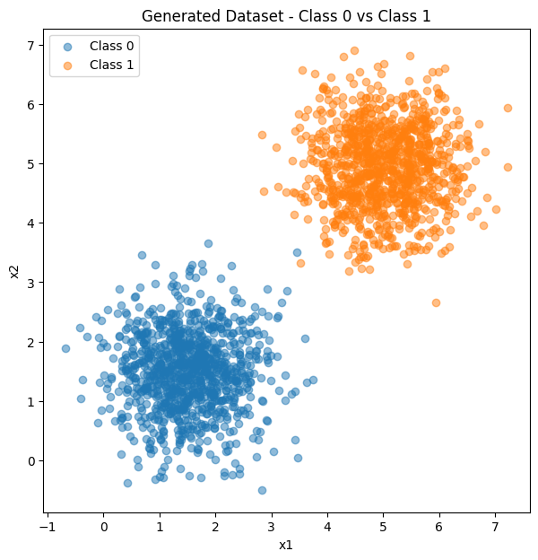
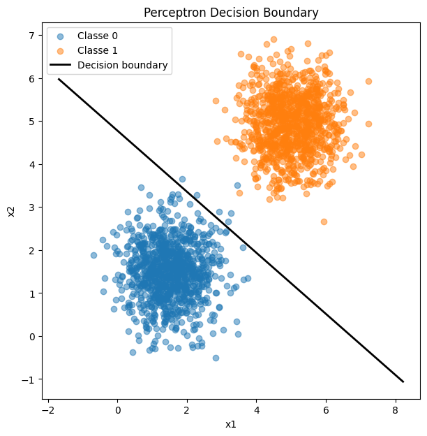
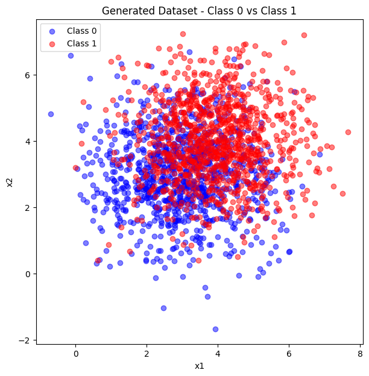
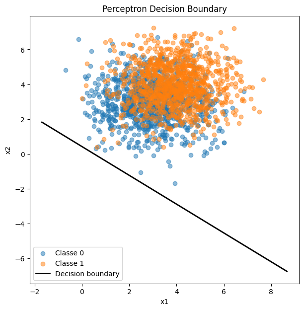
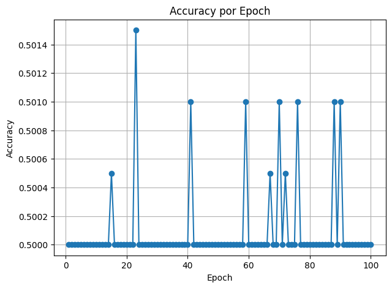
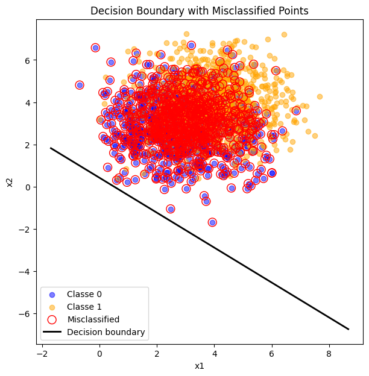

# Activity: Understanding Perceptrons and Their Limitations

# Exercise 1

## Data Generation Task
Generate two classes of 2D data points (1000 samples per class) using multivariate normal distributions.  

Use the following parameters:

- **Class 0**:  
  - Mean = [1.5, 1.5]  
  - Covariance matrix = [[0.5, 0], [0, 0.5]]  
    - Variance of 0.5 along each dimension  
    - No covariance  

- **Class 1**:  
  - Mean = [5, 5]  
  - Covariance matrix = [[0.5, 0], [0, 0.5]]  

These parameters ensure the classes are mostly linearly separable, with minimal overlap due to the distance between means and low variance.  
Plot the data points (using libraries like matplotlib if desired) to visualize the separation, coloring points by class.


```python
import numpy as np
import matplotlib.pyplot as plt

n_samples = 1000

# Class 0 
mean_class0 = [1.5, 1.5]
cov_class0 = [[0.5, 0], [0, 0.5]]

# Class 1
mean_class1 = [5, 5]
cov_class1 = [[0.5, 0], [0, 0.5]]

# gera os dados
X_class0 = np.random.multivariate_normal(mean_class0, cov_class0, n_samples)
X_class1 = np.random.multivariate_normal(mean_class1, cov_class1, n_samples)

# junta o dataset
X = np.vstack((X_class0, X_class1))
y = np.r_[np.zeros(n_samples), np.ones(n_samples)].astype(int)  # vetores de 1000 zeros e 1000 uns


# Plot
plt.figure(figsize=(7,7))
plt.scatter(X_class0[:,0], X_class0[:,1], alpha=0.5, label="Class 0")
plt.scatter(X_class1[:,0], X_class1[:,1], alpha=0.5, label="Class 1")
plt.xlabel("x1")
plt.ylabel("x2")
plt.legend()
plt.title("Generated Dataset - Class 0 vs Class 1")
plt.show()

```


    

    


## Perceptron Implementation Task:

Implement a single-layer perceptron from scratch to classify the generated data into the two classes. You may use NumPy only for basic linear algebra operations (e.g., matrix multiplication, vector addition/subtraction, dot products). Do not use any pre-built machine learning libraries (e.g., no scikit-learn) or NumPy functions that directly implement perceptron logic.

- Initialize weights (w) as a 2D vector (plus a bias term b). 

- Use the perceptron learning rule: For each misclassified sample (x, y), update  
  $w = w + \eta * y * x $ and $b = b + \eta * y$, where $\eta$ is the learning rate (start with $\eta = 0.01$).  

- Train the model until convergence (no weight updates occur in a full pass over the dataset) or for a maximum of 100 epochs, whichever comes first. If convergence is not achieved by 100 epochs, report the accuracy at that point. Track accuracy after each epoch.

- After training, evaluate accuracy on the full dataset and plot the decision boundary (line defined by $w \cdot x + b = 0$) overlaid on the data points. Additionally, plot the training accuracy over epochs to show convergence progress. Highlight any misclassified points in a separate plot or by different markers in the decision boundary plot.  

Report the final weights, bias, accuracy, and discuss why the data’s separability leads to quick convergence.


```python
learning = 0.01
epochs = 100
w = np.array([0.0, 0.0])
b = 0.0
erro = 0

updates = 0  # contar quantas vezes houve atualização

def activation(z):
    if z >= 0:
        return 1
    else:
        return 0

def accuracy(X, y, w, b):
    preds = [activation(np.dot(w, x) + b) for x in X]
    return np.mean(preds == y)


for epoch in range(epochs): # vai de 0 a 99
    teve_erro = 0
    for i in range(len(X)):
        analisado = X[i] 
        y_real = y[i]
        z = (w[0] * analisado[0] + w[1] * analisado[1]) + b
        y_previsto = activation(z)
        erro = y_real - y_previsto

        if erro != 0:
            teve_erro = 1
            updates += 1
            w += learning * erro * analisado
            b += learning * erro
    preds = np.array([activation(np.dot(w, x) + b) for x in X])
    acc = np.mean(preds == y)
    erros = np.sum(preds != y)
    print(f"Epoch {epoch+1}: W = {w}, B = {b}, Accuracy = {acc:.4f}, Erros = {erros}")


    if teve_erro == 0:
        print(f"\n Convergiu depois de {epoch+1} epochs com {updates} updates no total.")
        break 


# Plotar depois do treino
# ------------------------------------
import matplotlib.pyplot as plt
import numpy as np

# limites do gráfico
x_min, x_max = X[:,0].min() - 1, X[:,0].max() + 1
x_vals = np.linspace(x_min, x_max, 100)

# equação da reta de decisão: w1*x1 + w2*x2 + b = 0  => x2 = -(w1*x1 + b)/w2
y_vals = -(w[0] * x_vals + b) / w[1]

# pontos
plt.figure(figsize=(7,7))
plt.scatter(X[y==0,0], X[y==0,1], alpha=0.5, label="Classe 0")
plt.scatter(X[y==1,0], X[y==1,1], alpha=0.5, label="Classe 1")

# fronteira de decisão
plt.plot(x_vals, y_vals, color="black", linewidth=2, label="Decision boundary")

plt.xlabel("x1")
plt.ylabel("x2")
plt.legend()
plt.title("Perceptron Decision Boundary")
plt.show()

```

    Epoch 1: W = [0.03909103 0.04797968], B = 0.0, Accuracy = 0.5005, Erros = 999
    Epoch 2: W = [0.03801255 0.02968141], B = -0.03, Accuracy = 0.5060, Erros = 988
    Epoch 3: W = [0.04379876 0.04602322], B = -0.05, Accuracy = 0.5145, Erros = 971
    Epoch 4: W = [0.04958497 0.06236504], B = -0.07, Accuracy = 0.5185, Erros = 963
    Epoch 5: W = [0.04451232 0.06130865], B = -0.09, Accuracy = 0.5425, Erros = 915
    Epoch 6: W = [0.02138609 0.06422702], B = -0.10999999999999999, Accuracy = 0.6695, Erros = 661
    Epoch 7: W = [0.03402619 0.06863829], B = -0.11999999999999998, Accuracy = 0.6260, Erros = 748
    Epoch 8: W = [0.02634797 0.07564548], B = -0.12999999999999998, Accuracy = 0.6680, Erros = 664
    Epoch 9: W = [0.01866974 0.08265267], B = -0.13999999999999999, Accuracy = 0.7010, Erros = 598
    Epoch 10: W = [0.01099152 0.08965985], B = -0.15, Accuracy = 0.7420, Erros = 516
    Epoch 11: W = [0.02363162 0.09407113], B = -0.16, Accuracy = 0.6925, Erros = 615
    Epoch 12: W = [0.0159534  0.10107831], B = -0.17, Accuracy = 0.7260, Erros = 548
    Epoch 13: W = [0.00827517 0.1080855 ], B = -0.18000000000000002, Accuracy = 0.7640, Erros = 472
    Epoch 14: W = [0.00059695 0.11509269], B = -0.19000000000000003, Accuracy = 0.7960, Erros = 408
    Epoch 15: W = [0.0118057 0.092584 ], B = -0.21000000000000005, Accuracy = 0.9090, Erros = 182
    Epoch 16: W = [0.03355094 0.11605134], B = -0.21000000000000005, Accuracy = 0.7095, Erros = 581
    Epoch 17: W = [0.02587272 0.12305853], B = -0.22000000000000006, Accuracy = 0.7345, Erros = 531
    Epoch 18: W = [0.0113298  0.09542564], B = -0.24000000000000005, Accuracy = 0.9535, Erros = 93
    Epoch 19: W = [0.03307504 0.11889298], B = -0.24000000000000005, Accuracy = 0.7755, Erros = 449
    Epoch 20: W = [0.02539681 0.12590017], B = -0.25000000000000006, Accuracy = 0.8040, Erros = 392
    Epoch 21: W = [0.01771859 0.13290736], B = -0.26000000000000006, Accuracy = 0.8280, Erros = 344
    Epoch 22: W = [0.01004037 0.13991454], B = -0.2700000000000001, Accuracy = 0.8455, Erros = 309
    Epoch 23: W = [0.01931013 0.13218482], B = -0.2800000000000001, Accuracy = 0.8620, Erros = 276
    Epoch 24: W = [0.0285799 0.1244551], B = -0.2900000000000001, Accuracy = 0.8860, Erros = 228
    Epoch 25: W = [0.04346044 0.11328236], B = -0.3000000000000001, Accuracy = 0.9030, Erros = 194
    Epoch 26: W = [0.03578222 0.12028955], B = -0.3100000000000001, Accuracy = 0.9160, Erros = 168
    Epoch 27: W = [0.022968   0.10864413], B = -0.3200000000000001, Accuracy = 0.9770, Erros = 46
    Epoch 28: W = [0.03112936 0.1257143 ], B = -0.3200000000000001, Accuracy = 0.9275, Erros = 145
    Epoch 29: W = [0.04600991 0.11454157], B = -0.3300000000000001, Accuracy = 0.9370, Erros = 126
    Epoch 30: W = [0.03319569 0.10289614], B = -0.34000000000000014, Accuracy = 0.9835, Erros = 33
    Epoch 31: W = [0.04135705 0.11996632], B = -0.34000000000000014, Accuracy = 0.9425, Erros = 115
    Epoch 32: W = [0.02854283 0.10832089], B = -0.35000000000000014, Accuracy = 0.9855, Erros = 29
    Epoch 33: W = [0.03670419 0.12539107], B = -0.35000000000000014, Accuracy = 0.9485, Erros = 103
    Epoch 34: W = [0.03974839 0.11234247], B = -0.36000000000000015, Accuracy = 0.9750, Erros = 50
    Epoch 35: W = [0.0623132  0.11991825], B = -0.36000000000000015, Accuracy = 0.9260, Erros = 148
    Epoch 36: W = [0.0410511  0.12052827], B = -0.37000000000000016, Accuracy = 0.9690, Erros = 62
    Epoch 37: W = [0.06361591 0.12810405], B = -0.37000000000000016, Accuracy = 0.9125, Erros = 175
    Epoch 38: W = [0.04235381 0.12871407], B = -0.38000000000000017, Accuracy = 0.9600, Erros = 80
    Epoch 39: W = [0.05324019 0.13478322], B = -0.38000000000000017, Accuracy = 0.9315, Erros = 137
    Epoch 40: W = [0.05217748 0.12539702], B = -0.3900000000000002, Accuracy = 0.9600, Erros = 80
    Epoch 41: W = [0.03936326 0.11375159], B = -0.4000000000000002, Accuracy = 0.9900, Erros = 20
    Epoch 42: W = [0.06053962 0.12852019], B = -0.4000000000000002, Accuracy = 0.9460, Erros = 108
    Epoch 43: W = [0.0477254  0.11687476], B = -0.4100000000000002, Accuracy = 0.9855, Erros = 29
    Epoch 44: W = [0.07029021 0.12445054], B = -0.4100000000000002, Accuracy = 0.9445, Erros = 111
    Epoch 45: W = [0.04902811 0.12506056], B = -0.4200000000000002, Accuracy = 0.9815, Erros = 37
    Epoch 46: W = [0.05991448 0.13112971], B = -0.4200000000000002, Accuracy = 0.9615, Erros = 77
    Epoch 47: W = [0.04710027 0.11948428], B = -0.4300000000000002, Accuracy = 0.9880, Erros = 24
    Epoch 48: W = [0.05834691 0.13227517], B = -0.4300000000000002, Accuracy = 0.9660, Erros = 68
    Epoch 49: W = [0.04553269 0.12062974], B = -0.4400000000000002, Accuracy = 0.9920, Erros = 16
    Epoch 50: W = [0.05677933 0.13342063], B = -0.4400000000000002, Accuracy = 0.9715, Erros = 57
    Epoch 51: W = [0.04396512 0.1217752 ], B = -0.45000000000000023, Accuracy = 0.9930, Erros = 14
    Epoch 52: W = [0.05521176 0.13456609], B = -0.45000000000000023, Accuracy = 0.9770, Erros = 46
    Epoch 53: W = [0.06268195 0.14065899], B = -0.45000000000000023, Accuracy = 0.9630, Erros = 74
    Epoch 54: W = [0.04986773 0.12901357], B = -0.46000000000000024, Accuracy = 0.9870, Erros = 26
    Epoch 55: W = [0.07243254 0.13658935], B = -0.46000000000000024, Accuracy = 0.9615, Erros = 77
    Epoch 56: W = [0.05961833 0.12494393], B = -0.47000000000000025, Accuracy = 0.9875, Erros = 25
    Epoch 57: W = [0.0705047  0.13101307], B = -0.47000000000000025, Accuracy = 0.9765, Erros = 47
    Epoch 58: W = [0.05769048 0.11936765], B = -0.48000000000000026, Accuracy = 0.9950, Erros = 10
    Epoch 59: W = [0.06893712 0.13215853], B = -0.48000000000000026, Accuracy = 0.9815, Erros = 37
    Epoch 60: W = [0.07994618 0.13539028], B = -0.48000000000000026, Accuracy = 0.9640, Erros = 72
    Epoch 61: W = [0.06713196 0.12374485], B = -0.4900000000000002, Accuracy = 0.9890, Erros = 22
    Epoch 62: W = [0.07801833 0.129814  ], B = -0.4900000000000002, Accuracy = 0.9780, Erros = 44
    Epoch 63: W = [0.06520411 0.11816857], B = -0.5000000000000002, Accuracy = 0.9965, Erros = 7
    Epoch 64: W = [0.08776892 0.12574436], B = -0.5000000000000002, Accuracy = 0.9790, Erros = 42
    Epoch 65: W = [0.07495471 0.11409893], B = -0.5100000000000002, Accuracy = 0.9965, Erros = 7
    Epoch 66: W = [0.08312732 0.12576891], B = -0.5100000000000002, Accuracy = 0.9865, Erros = 27
    Epoch 67: W = [0.08552487 0.13040795], B = -0.5100000000000002, Accuracy = 0.9805, Erros = 39
    Epoch 68: W = [0.07271065 0.11876252], B = -0.5200000000000002, Accuracy = 0.9970, Erros = 6
    Epoch 69: W = [0.08088327 0.1304325 ], B = -0.5200000000000002, Accuracy = 0.9870, Erros = 26
    Epoch 70: W = [0.08328081 0.13507154], B = -0.5200000000000002, Accuracy = 0.9810, Erros = 38
    Epoch 71: W = [0.07046659 0.12342612], B = -0.5300000000000002, Accuracy = 0.9965, Erros = 7
    Epoch 72: W = [0.07863921 0.1350961 ], B = -0.5300000000000002, Accuracy = 0.9875, Erros = 25
    Epoch 73: W = [0.08964827 0.13832784], B = -0.5300000000000002, Accuracy = 0.9770, Erros = 46
    Epoch 74: W = [0.07683405 0.12668242], B = -0.5400000000000003, Accuracy = 0.9940, Erros = 12
    Epoch 75: W = [0.08772042 0.13275156], B = -0.5400000000000003, Accuracy = 0.9870, Erros = 26
    Epoch 76: W = [0.0749062  0.12110614], B = -0.5500000000000003, Accuracy = 0.9970, Erros = 6
    Epoch 77: W = [0.08307882 0.13277612], B = -0.5500000000000003, Accuracy = 0.9895, Erros = 21
    Epoch 78: W = [0.09408787 0.13600786], B = -0.5500000000000003, Accuracy = 0.9840, Erros = 32
    Epoch 79: W = [0.08127366 0.12436243], B = -0.5600000000000003, Accuracy = 0.9970, Erros = 6
    Epoch 80: W = [0.09216003 0.13043158], B = -0.5600000000000003, Accuracy = 0.9890, Erros = 22
    Epoch 81: W = [0.09455757 0.13507063], B = -0.5600000000000003, Accuracy = 0.9865, Erros = 27
    Epoch 82: W = [0.08174335 0.1234252 ], B = -0.5700000000000003, Accuracy = 0.9970, Erros = 6
    Epoch 83: W = [0.09262973 0.12949435], B = -0.5700000000000003, Accuracy = 0.9905, Erros = 19
    Epoch 84: W = [0.09502727 0.13413339], B = -0.5700000000000003, Accuracy = 0.9880, Erros = 24
    Epoch 85: W = [0.08221305 0.12248796], B = -0.5800000000000003, Accuracy = 0.9970, Erros = 6
    Epoch 86: W = [0.09038567 0.13415794], B = -0.5800000000000003, Accuracy = 0.9910, Erros = 18
    Epoch 87: W = [0.10139472 0.13738969], B = -0.5800000000000003, Accuracy = 0.9860, Erros = 28
    Epoch 88: W = [0.0885805  0.12574426], B = -0.5900000000000003, Accuracy = 0.9970, Erros = 6
    Epoch 89: W = [0.09946688 0.13181341], B = -0.5900000000000003, Accuracy = 0.9905, Erros = 19
    Epoch 90: W = [0.10186442 0.13645245], B = -0.5900000000000003, Accuracy = 0.9880, Erros = 24
    Epoch 91: W = [0.0890502  0.12480702], B = -0.6000000000000003, Accuracy = 0.9970, Erros = 6
    Epoch 92: W = [0.09993658 0.13087617], B = -0.6000000000000003, Accuracy = 0.9925, Erros = 15
    Epoch 93: W = [0.10233412 0.13551522], B = -0.6000000000000003, Accuracy = 0.9895, Erros = 21
    Epoch 94: W = [0.0895199  0.12386979], B = -0.6100000000000003, Accuracy = 0.9970, Erros = 6
    Epoch 95: W = [0.09769252 0.13553977], B = -0.6100000000000003, Accuracy = 0.9925, Erros = 15
    Epoch 96: W = [0.10009006 0.14017881], B = -0.6100000000000003, Accuracy = 0.9900, Erros = 20
    Epoch 97: W = [0.08727584 0.12853338], B = -0.6200000000000003, Accuracy = 0.9970, Erros = 6
    Epoch 98: W = [0.09544846 0.14020336], B = -0.6200000000000003, Accuracy = 0.9925, Erros = 15
    Epoch 99: W = [0.10645752 0.14343511], B = -0.6200000000000003, Accuracy = 0.9880, Erros = 24
    Epoch 100: W = [0.0936433  0.13178968], B = -0.6300000000000003, Accuracy = 0.9970, Erros = 6


    

    


Após o treinamento, o perceptron convergiu com os seguintes resultados:

* **Pesos finais (w):** \[ $0.0936433$, $0.13178968$ ]
* **Bias final (b):** $-0.6300000000000003$
* **Acurácia:** 99,7%

Durante o treinamento, o perceptron iniciou com acurácia próxima de 50%, praticamente classificando ao acaso. Ao longo das épocas, os pesos e o bias foram sendo ajustados e a acurácia subiu progressivamente, chegando a 99,7% na época 100, com apenas 6 erros no total de 2000 amostras.

O fato de a acurácia não ter atingido 100% pode ser explicado pelas características estatísticas do dataset devido a presença de pontos de sobreposição entre as distribuições das duas classes. Embora os dados tenham sido gerados de forma linearmente separável em média, eles vêm de distribuições normais multivariadas. Esses pontos "ruído" fazem com que não exista uma reta que consiga separar perfeitamente todas as amostras.


# Exercise 2

## Data Generation Task:
Generate two classes of 2D data points (1000 samples per class) using multivariate normal distributions. Use the following parameters:

- **Class 0**:  
  Mean = [3, 3],  
  Covariance matrix = [[1.5, 0], [0, 1.5]] (i.e., higher variance of 1.5 along each dimension).  

- **Class 1**:  
  Mean = [4, 4],  
  Covariance matrix = [[1.5, 0], [0, 1.5]].  

These parameters create partial overlap between classes due to closer means and higher variance, making the data not fully linearly separable. Plot the data points to visualize the overlap, coloring points by class.  


```python
import numpy as np
import matplotlib.pyplot as plt

n_samples = 1000

# Class 0 
mean_class0_2 = [3, 3]
cov_class0_2 = [[1.5, 0], [0, 1.5]]

# Class 1
mean_class1_2 = [4, 4]
cov_class1_2 = [[1.5, 0], [0, 1.5]]

# gera os dados
X_class0_2 = np.random.multivariate_normal(mean_class0_2, cov_class0_2, n_samples)
X_class1_2 = np.random.multivariate_normal(mean_class1_2, cov_class1_2, n_samples)

# junta o dataset
X_2 = np.vstack((X_class0_2, X_class1_2))
y_2 = np.r_[np.zeros(n_samples), np.ones(n_samples)].astype(int)  # vetores de 1000 zeros e 1000 uns


# Plot
plt.figure(figsize=(7,7))
plt.scatter(X_class0_2[:,0], X_class0_2[:,1], color = 'blue', alpha=0.5, label="Class 0")
plt.scatter(X_class1_2[:,0], X_class1_2[:,1], color = 'red', alpha=0.5, label="Class 1")
plt.xlabel("x1")
plt.ylabel("x2")
plt.legend()
plt.title("Generated Dataset - Class 0 vs Class 1")
plt.show()

```


    

    


## Perceptron Implementation Task:
Using the same implementation guidelines as in Exercise 1, train a perceptron on this dataset:

- Follow the same initialization, update rule, and training process. 

- Train the model until convergence (no weight updates occur in a full pass over the dataset) or for a maximum of 100 epochs, whichever comes first. If convergence is not achieved by 100 epochs, report the accuracy at that point and note any oscillation in updates; consider reporting the best accuracy achieved over multiple runs (e.g., average over 5 random initializations). Track accuracy after each epoch.  

- Evaluate accuracy after training and plot the decision boundary overlaid on the data points. Additionally, plot the training accuracy over epochs to show convergence progress (or lack thereof). Highlight any misclassified points in a separate plot or by different markers in the decision boundary plot.  

Report the final weights, bias, accuracy, and discuss how the overlap affects training compared to Exercise 1 (e.g., slower convergence or inability to reach 100% accuracy).


```python
learning = 0.01
epochs = 100
w_2 = np.array([0.0, 0.0])
b_2 = 0.0
erro_2 = 0

updates_2 = 0  # contar quantas vezes houve atualização

accuracies_2 = []

def activation(z):
    if z >= 0:
        return 1
    else:
        return 0


for epoch in range(epochs): # vai de 0 a 99
    teve_erro_2 = 0
    for i in range(len(X_2)):
        analisado_2 = X_2[i] 
        y_real_2 = y_2[i]
        z_2 = (w_2[0] * analisado_2[0] + w_2[1] * analisado_2[1]) + b_2
        y_previsto_2 = activation(z_2)
        erro_2 = y_real_2 - y_previsto_2

        if erro_2 != 0:
            teve_erro_2 = 1
            updates_2 += 1
            w_2 += learning * erro_2 * analisado_2
            b_2 += learning * erro_2
    preds_2 = np.array([activation(np.dot(w_2, x) + b_2) for x in X_2])
    acc_2 = np.mean(preds_2 == y_2)
    accuracies_2.append(acc_2)
    erros_2 = np.sum(preds_2 != y_2)
    print(f"Epoch {epoch+1}: W = {w_2}, B = {b_2}, Accuracy = {acc_2:.4f}, Erros = {erros_2}")


    if teve_erro_2 == 0:
        print(f"\n Convergiu depois de {epoch+1} epochs com {updates_2} updates no total.")
        break 


# Plotar depois do treino
# ------------------------------------
import matplotlib.pyplot as plt
import numpy as np

# limites do gráfico
x_min_2, x_max_2 = X_2[:,0].min() - 1, X_2[:,0].max() + 1
x_vals_2 = np.linspace(x_min_2, x_max_2, 100)

# equação da reta de decisão: w1*x1 + w2*x2 + b = 0  => x2 = -(w1*x1 + b)/w2
y_vals_2 = -(w_2[0] * x_vals_2 + b_2) / w_2[1]

# pontos
plt.figure(figsize=(7,7))
plt.scatter(X_2[y_2==0,0], X_2[y_2==0,1], alpha=0.5, label="Classe 0")
plt.scatter(X_2[y_2==1,0], X_2[y_2==1,1], alpha=0.5, label="Classe 1")

# fronteira de decisão
plt.plot(x_vals_2, y_vals_2, color="black", linewidth=2, label="Decision boundary")

plt.xlabel("x1")
plt.ylabel("x2")
plt.legend()
plt.title("Perceptron Decision Boundary")
plt.show()

```

    Epoch 1: W = [0.04570227 0.03395184], B = 0.01, Accuracy = 0.5000, Erros = 1000
    Epoch 2: W = [0.0421719  0.03914527], B = 0.01, Accuracy = 0.5000, Erros = 1000
    Epoch 3: W = [0.01969512 0.04468654], B = 0.01, Accuracy = 0.5000, Erros = 1000
    Epoch 4: W = [0.03651198 0.03808257], B = 0.01, Accuracy = 0.5000, Erros = 1000
    Epoch 5: W = [0.05332885 0.0314786 ], B = 0.01, Accuracy = 0.5000, Erros = 1000
    Epoch 6: W = [0.03079092 0.04171783], B = 0.0, Accuracy = 0.5000, Erros = 1000
    Epoch 7: W = [0.04760778 0.03511386], B = 0.0, Accuracy = 0.5000, Erros = 1000
    Epoch 8: W = [0.04407741 0.04030729], B = 0.0, Accuracy = 0.5000, Erros = 1000
    Epoch 9: W = [0.02160063 0.04584855], B = 0.0, Accuracy = 0.5000, Erros = 1000
    Epoch 10: W = [0.03841749 0.03924458], B = 0.0, Accuracy = 0.5000, Erros = 1000
    Epoch 11: W = [0.05523436 0.03264061], B = 0.0, Accuracy = 0.5000, Erros = 1000
    Epoch 12: W = [0.03269643 0.04287984], B = -0.009999999999999997, Accuracy = 0.5000, Erros = 1000
    Epoch 13: W = [0.04951329 0.03627587], B = -0.009999999999999997, Accuracy = 0.5000, Erros = 1000
    Epoch 14: W = [0.04598292 0.0414693 ], B = -0.009999999999999997, Accuracy = 0.5000, Erros = 1000
    Epoch 15: W = [0.02350614 0.04701057], B = -0.009999999999999997, Accuracy = 0.5005, Erros = 999
    Epoch 16: W = [0.04032301 0.0404066 ], B = -0.009999999999999997, Accuracy = 0.5000, Erros = 1000
    Epoch 17: W = [0.04827013 0.04822419], B = -0.009999999999999997, Accuracy = 0.5000, Erros = 1000
    Epoch 18: W = [0.02313457 0.01449807], B = -0.009999999999999997, Accuracy = 0.5000, Erros = 1000
    Epoch 19: W = [0.01756352 0.0126953 ], B = -0.009999999999999997, Accuracy = 0.5000, Erros = 1000
    Epoch 20: W = [0.01199247 0.01089254], B = -0.009999999999999997, Accuracy = 0.5000, Erros = 1000
    Epoch 21: W = [0.01273318 0.01300163], B = 3.469446951953614e-18, Accuracy = 0.5000, Erros = 1000
    Epoch 22: W = [0.00716213 0.01119886], B = 3.469446951953614e-18, Accuracy = 0.5000, Erros = 1000
    Epoch 23: W = [0.00159107 0.00939609], B = 3.469446951953614e-18, Accuracy = 0.5015, Erros = 997
    Epoch 24: W = [0.06068634 0.02999147], B = 0.010000000000000004, Accuracy = 0.5000, Erros = 1000
    Epoch 25: W = [0.04101374 0.02765819], B = 3.469446951953614e-18, Accuracy = 0.5000, Erros = 1000
    Epoch 26: W = [0.01466058 0.00813467], B = 3.469446951953614e-18, Accuracy = 0.5000, Erros = 1000
    Epoch 27: W = [0.00908953 0.0063319 ], B = 3.469446951953614e-18, Accuracy = 0.5000, Erros = 1000
    Epoch 28: W = [0.00351848 0.00452914], B = 3.469446951953614e-18, Accuracy = 0.5000, Erros = 1000
    Epoch 29: W = [0.04922075 0.03848098], B = 0.010000000000000004, Accuracy = 0.5000, Erros = 1000
    Epoch 30: W = [0.02674397 0.04402225], B = 0.010000000000000004, Accuracy = 0.5000, Erros = 1000
    Epoch 31: W = [0.04356083 0.03741828], B = 0.010000000000000004, Accuracy = 0.5000, Erros = 1000
    Epoch 32: W = [0.02108405 0.04295954], B = 0.010000000000000004, Accuracy = 0.5000, Erros = 1000
    Epoch 33: W = [0.03790091 0.03635557], B = 0.010000000000000004, Accuracy = 0.5000, Erros = 1000
    Epoch 34: W = [0.05471778 0.0297516 ], B = 0.010000000000000004, Accuracy = 0.5000, Erros = 1000
    Epoch 35: W = [0.03217985 0.03999083], B = 3.469446951953614e-18, Accuracy = 0.5000, Erros = 1000
    Epoch 36: W = [0.04899671 0.03338686], B = 3.469446951953614e-18, Accuracy = 0.5000, Erros = 1000
    Epoch 37: W = [0.04546634 0.03858029], B = 3.469446951953614e-18, Accuracy = 0.5000, Erros = 1000
    Epoch 38: W = [0.02298956 0.04412156], B = 3.469446951953614e-18, Accuracy = 0.5000, Erros = 1000
    Epoch 39: W = [0.03980643 0.03751759], B = 3.469446951953614e-18, Accuracy = 0.5000, Erros = 1000
    Epoch 40: W = [0.04775355 0.04533517], B = 3.469446951953614e-18, Accuracy = 0.5000, Erros = 1000
    Epoch 41: W = [0.01333189 0.03500201], B = 3.469446951953614e-18, Accuracy = 0.5010, Erros = 998
    Epoch 42: W = [0.0265806 0.0377061], B = -0.009999999999999997, Accuracy = 0.5000, Erros = 1000
    Epoch 43: W = [0.05476662 0.04016423], B = -0.009999999999999997, Accuracy = 0.5000, Erros = 1000
    Epoch 44: W = [0.03228984 0.0457055 ], B = -0.009999999999999997, Accuracy = 0.5000, Erros = 1000
    Epoch 45: W = [0.04910671 0.03910153], B = -0.009999999999999997, Accuracy = 0.5000, Erros = 1000
    Epoch 46: W = [0.02662993 0.04464279], B = -0.009999999999999997, Accuracy = 0.5000, Erros = 1000
    Epoch 47: W = [0.04344679 0.03803882], B = -0.009999999999999997, Accuracy = 0.5000, Erros = 1000
    Epoch 48: W = [0.05139392 0.04585641], B = -0.009999999999999997, Accuracy = 0.5000, Erros = 1000
    Epoch 49: W = [0.02625836 0.0121303 ], B = -0.009999999999999997, Accuracy = 0.5000, Erros = 1000
    Epoch 50: W = [0.02068731 0.01032753], B = -0.009999999999999997, Accuracy = 0.5000, Erros = 1000
    Epoch 51: W = [0.01511625 0.00852476], B = -0.009999999999999997, Accuracy = 0.5000, Erros = 1000
    Epoch 52: W = [0.01585696 0.01063385], B = 3.469446951953614e-18, Accuracy = 0.5000, Erros = 1000
    Epoch 53: W = [0.01028591 0.00883108], B = 3.469446951953614e-18, Accuracy = 0.5000, Erros = 1000
    Epoch 54: W = [0.00471486 0.00702832], B = 3.469446951953614e-18, Accuracy = 0.5000, Erros = 1000
    Epoch 55: W = [0.03371654 0.0091362 ], B = 0.010000000000000004, Accuracy = 0.5000, Erros = 1000
    Epoch 56: W = [0.02664111 0.04269985], B = 0.010000000000000004, Accuracy = 0.5000, Erros = 1000
    Epoch 57: W = [0.04345797 0.03609588], B = 0.010000000000000004, Accuracy = 0.5000, Erros = 1000
    Epoch 58: W = [0.0399276  0.04128931], B = 0.010000000000000004, Accuracy = 0.5000, Erros = 1000
    Epoch 59: W = [0.01538659 0.06299399], B = 0.010000000000000004, Accuracy = 0.5010, Erros = 998
    Epoch 60: W = [0.03220345 0.05639002], B = 0.010000000000000004, Accuracy = 0.5000, Erros = 1000
    Epoch 61: W = [0.03231973 0.01794209], B = 0.010000000000000004, Accuracy = 0.5000, Erros = 1000
    Epoch 62: W = [0.05492553 0.04280816], B = 0.010000000000000004, Accuracy = 0.5000, Erros = 1000
    Epoch 63: W = [0.0323876  0.05304739], B = 3.469446951953614e-18, Accuracy = 0.5000, Erros = 1000
    Epoch 64: W = [0.03250387 0.01459946], B = 3.469446951953614e-18, Accuracy = 0.5000, Erros = 1000
    Epoch 65: W = [0.05224435 0.05203803], B = 3.469446951953614e-18, Accuracy = 0.5000, Erros = 1000
    Epoch 66: W = [0.01778789 0.00967945], B = -0.009999999999999997, Accuracy = 0.5000, Erros = 1000
    Epoch 67: W = [0.01221684 0.00787669], B = -0.009999999999999997, Accuracy = 0.5005, Erros = 999
    Epoch 68: W = [0.01295755 0.00998577], B = 3.469446951953614e-18, Accuracy = 0.5000, Erros = 1000
    Epoch 69: W = [0.0073865  0.00818301], B = 3.469446951953614e-18, Accuracy = 0.5000, Erros = 1000
    Epoch 70: W = [0.00181544 0.00638024], B = 3.469446951953614e-18, Accuracy = 0.5010, Erros = 998
    Epoch 71: W = [0.04751771 0.04033209], B = 0.010000000000000004, Accuracy = 0.5000, Erros = 1000
    Epoch 72: W = [0.0229767  0.06203677], B = 0.010000000000000004, Accuracy = 0.5005, Erros = 999
    Epoch 73: W = [0.04864347 0.05459384], B = 0.010000000000000004, Accuracy = 0.5000, Erros = 1000
    Epoch 74: W = [0.01418701 0.01223526], B = 3.469446951953614e-18, Accuracy = 0.5000, Erros = 1000
    Epoch 75: W = [0.00861596 0.01043249], B = 3.469446951953614e-18, Accuracy = 0.5000, Erros = 1000
    Epoch 76: W = [0.0030449  0.00862973], B = 3.469446951953614e-18, Accuracy = 0.5010, Erros = 998
    Epoch 77: W = [0.06214017 0.02922511], B = 0.010000000000000004, Accuracy = 0.5000, Erros = 1000
    Epoch 78: W = [0.04246757 0.02689182], B = 3.469446951953614e-18, Accuracy = 0.5000, Erros = 1000
    Epoch 79: W = [0.01611441 0.00736831], B = 3.469446951953614e-18, Accuracy = 0.5000, Erros = 1000
    Epoch 80: W = [0.01054336 0.00556554], B = 3.469446951953614e-18, Accuracy = 0.5000, Erros = 1000
    Epoch 81: W = [0.00497231 0.00376277], B = 3.469446951953614e-18, Accuracy = 0.5000, Erros = 1000
    Epoch 82: W = [0.03397399 0.00587065], B = 0.010000000000000004, Accuracy = 0.5000, Erros = 1000
    Epoch 83: W = [0.02689856 0.0394343 ], B = 0.010000000000000004, Accuracy = 0.5000, Erros = 1000
    Epoch 84: W = [0.04371542 0.03283033], B = 0.010000000000000004, Accuracy = 0.5000, Erros = 1000
    Epoch 85: W = [0.05166255 0.04064792], B = 0.010000000000000004, Accuracy = 0.5000, Erros = 1000
    Epoch 86: W = [0.02912462 0.05088715], B = 3.469446951953614e-18, Accuracy = 0.5000, Erros = 1000
    Epoch 87: W = [0.04594148 0.04428318], B = 3.469446951953614e-18, Accuracy = 0.5000, Erros = 1000
    Epoch 88: W = [0.01325915 0.04123555], B = 3.469446951953614e-18, Accuracy = 0.5010, Erros = 998
    Epoch 89: W = [0.0090533  0.01659682], B = 3.469446951953614e-18, Accuracy = 0.5000, Erros = 1000
    Epoch 90: W = [0.00348225 0.01479405], B = 3.469446951953614e-18, Accuracy = 0.5010, Erros = 998
    Epoch 91: W = [0.03248392 0.01690194], B = 0.010000000000000004, Accuracy = 0.5000, Erros = 1000
    Epoch 92: W = [0.05508973 0.041768  ], B = 0.010000000000000004, Accuracy = 0.5000, Erros = 1000
    Epoch 93: W = [0.0325518  0.05200723], B = 3.469446951953614e-18, Accuracy = 0.5000, Erros = 1000
    Epoch 94: W = [0.06276166 0.0320468 ], B = 3.469446951953614e-18, Accuracy = 0.5000, Erros = 1000
    Epoch 95: W = [0.04022373 0.04228602], B = -0.009999999999999997, Accuracy = 0.5000, Erros = 1000
    Epoch 96: W = [0.03669336 0.04747945], B = -0.009999999999999997, Accuracy = 0.5000, Erros = 1000
    Epoch 97: W = [0.03615926 0.02893686], B = -0.009999999999999997, Accuracy = 0.5000, Erros = 1000
    Epoch 98: W = [0.03058821 0.02713409], B = -0.009999999999999997, Accuracy = 0.5000, Erros = 1000
    Epoch 99: W = [0.02501716 0.02533133], B = -0.009999999999999997, Accuracy = 0.5000, Erros = 1000
    Epoch 100: W = [0.01944611 0.02352856], B = -0.009999999999999997, Accuracy = 0.5000, Erros = 1000


    

    


```python
plt.figure(figsize=(7,5))
plt.plot(range(1, len(accuracies_2)+1), accuracies_2, marker="o")
plt.xlabel("Epoch")
plt.ylabel("Accuracy")
plt.title("Accuracy por Epoch")
plt.grid(True)
plt.show()

```


    

    


```python
# Identificar erros
misclassified = preds_2 != y_2

plt.figure(figsize=(7,7))
plt.scatter(X_2[y_2==0,0], X_2[y_2==0,1], alpha=0.5, label="Classe 0", color="blue")
plt.scatter(X_2[y_2==1,0], X_2[y_2==1,1], alpha=0.5, label="Classe 1", color="orange")
plt.scatter(X_2[misclassified,0], X_2[misclassified,1], 
            facecolors='none', edgecolors='red', s=100, label="Misclassified")

# Fronteira de decisão
plt.plot(x_vals_2, y_vals_2, color="black", linewidth=2, label="Decision boundary")
plt.xlabel("x1")
plt.ylabel("x2")
plt.legend()
plt.title("Decision Boundary with Misclassified Points")
plt.show()

```


    

    


## Conclusão

No Exercício 2, o perceptron foi treinado em um dataset com médias mais próximas $[3,3]$ e $[4,4]$ e variância maior (1.5). Como esperado, isso gerou uma forte sobreposição entre as classes, tornando impossível separá-las perfeitamente com uma reta.

O gráfico de acurácia por época mostra que o desempenho do perceptron oscilou em torno de 50%, sem sinais de convergência estável. Diferente do Exercício 1, onde a separação linear clara permitiu atingir quase 100% de acurácia, aqui o perceptron não consegue aprender uma fronteira que divida corretamente todos os pontos.

O gráfico da fronteira de decisão com pontos mal classificados confirma esse resultado: há uma grande quantidade de amostras de ambas as classes no lado “errado” da linha, o que explica a limitação do modelo.
