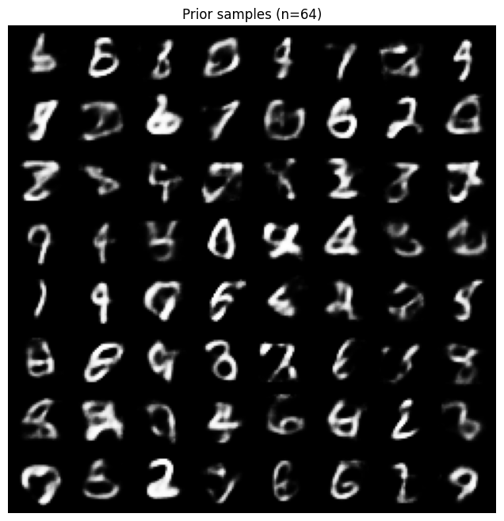
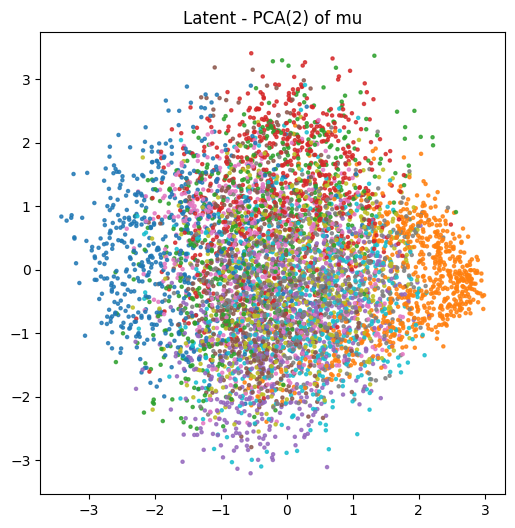
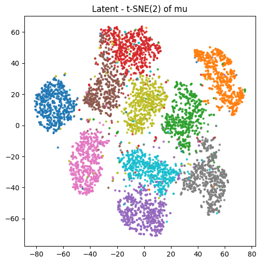
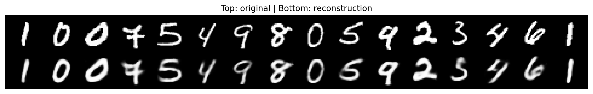

# Activity: VAE Implementation

In this exercise, you will implement and evaluate a Variational Autoencoder (VAE) on the MNIST or Fashion MNIST dataset. The goal is to understand the architecture, training process, and performance of VAEs.

## Instructions

1. Data Preparation:

    - Load the MNIST/Fashion MNIST dataset;
    - Normalize the images to the range [0, 1];
    - Split the dataset into training and validation sets.

2. Model Implementation:

    - Define the VAE architecture, including the encoder and decoder networks;
    - Implement the reparameterization trick.

3. Training:

    - Train the VAE on the MNIST/Fashion MNIST dataset;
    - Monitor the loss and generate reconstructions during training.

4. Evaluation:

    - Evaluate the VAE's performance on the validation set;
    - Generate new samples from the learned latent space.

5. Visualization:

    - Visualize original and reconstructed images;
    - Visualize the latent space (in case of a latent space until 3-D, otherwise use a reduced visualization, e.g., using t-SNE, UMAP or PCA).

6. Report:

    - Summarize your findings, including challenges faced and insights gained;
    - Include visualizations of reconstructions and latent space.

7. Extra Credit (Optional):

    - Experiment the same dataset with a Autoencoder (AE) and compare the results with the VAE;
    - Experiment with different latent space dimensions and report the effects on reconstruction quality and sample generation.

# 1. Data Preparation:

- Load the MNIST/Fashion MNIST dataset;
- Normalize the images to the range [0, 1];
- Split the dataset into training and validation sets.


```python
import torch
from torch.utils.data import DataLoader, random_split
from torchvision import datasets, transforms
import os
import random
import numpy as np

# ---------- Config ----------
seed = 42
dataset_root = "./data"
download = True
batch_size = 128
val_fraction = 0.1       # fração do conjunto de treino reservada para validação
num_workers = 4 if torch.cuda.is_available() else 0
pin_memory = torch.cuda.is_available()
# ---------------------------

# Reprodutibilidade
torch.manual_seed(seed)
np.random.seed(seed)
random.seed(seed)
if torch.cuda.is_available():
    torch.cuda.manual_seed_all(seed)

# Transform: ToTensor() já normaliza para [0,1]
transform = transforms.Compose([
    transforms.ToTensor(),  # converte PIL->Tensor e escala para [0,1]
])

# Escolha do dataset
DatasetClass = datasets.MNIST
dataset_name = "MNIST"

# Download / load dataset (train=True pega todo o conjunto de treino)
train_val_dataset = DatasetClass(root=dataset_root,
                                 train=True,
                                 transform=transform,
                                 download=download)

test_dataset = DatasetClass(root=dataset_root,
                            train=False,
                            transform=transform,
                            download=download)

# Criar split treino / validação
total_train = len(train_val_dataset)
n_val = int(total_train * val_fraction)
n_train = total_train - n_val

train_dataset, val_dataset = random_split(train_val_dataset, [n_train, n_val],
                                          generator=torch.Generator().manual_seed(seed))

# DataLoaders
train_loader = DataLoader(train_dataset, batch_size=batch_size, shuffle=True,
                          num_workers=num_workers, pin_memory=pin_memory)
val_loader = DataLoader(val_dataset, batch_size=batch_size, shuffle=False,
                        num_workers=num_workers, pin_memory=pin_memory)
test_loader = DataLoader(test_dataset, batch_size=batch_size, shuffle=False,
                         num_workers=num_workers, pin_memory=pin_memory)

# Quick sanity checks / prints
print(f"Dataset: {dataset_name}")
print(f"Total train+val samples: {total_train}")
print(f"Train samples: {len(train_dataset)}")
print(f"Validation samples: {len(val_dataset)}")
print(f"Test samples: {len(test_dataset)}")
print(f"Batch size: {batch_size}")
print(f"Num workers: {num_workers}")
print("Example tensor shapes from one batch (train):")

# pegar um batch e mostrar shapes / value range
batch = next(iter(train_loader))
# Para datasets torchvision, batch = (images, labels)
images, labels = batch
print(" images.shape:", images.shape)   # espera [B, 1, 28, 28]
print(" labels.shape:", labels.shape)
print(" min pixel value:", images.min().item())
print(" max pixel value:", images.max().item())
```

    100.0%
    100.0%
    100.0%
    100.0%

    Dataset: MNIST
    Total train+val samples: 60000
    Train samples: 54000
    Validation samples: 6000
    Test samples: 10000
    Batch size: 128
    Num workers: 0
    Example tensor shapes from one batch (train):
     images.shape: torch.Size([128, 1, 28, 28])
     labels.shape: torch.Size([128])
     min pixel value: 0.0
     max pixel value: 1.0


    


# 2. Model Implementation:

- Define the VAE architecture, including the encoder and decoder networks;
- Implement the reparameterization trick.


```python
import torch.nn as nn
import torch.nn.functional as F
from typing import Tuple

class VAE(nn.Module):
    """
    VAE fully-connected para MNIST (imagens 28x28).
    Encoder: 784 -> hidden_dim -> (mu, logvar) [latent_dim]
    Decoder: latent_dim -> hidden_dim -> 784
    Saída do decoder usa sigmoid (valores em [0,1]).
    """
    def __init__(self, input_shape: Tuple[int,int]=(1,28,28), hidden_dim: int = 400, latent_dim: int = 20):
        super().__init__()
        C, H, W = input_shape
        self.input_dim = C * H * W
        self.hidden_dim = hidden_dim
        self.latent_dim = latent_dim

        # --- Encoder ---
        self.fc1 = nn.Linear(self.input_dim, hidden_dim)
        self.fc_mu = nn.Linear(hidden_dim, latent_dim)
        self.fc_logvar = nn.Linear(hidden_dim, latent_dim)

        # --- Decoder ---
        self.fc_dec1 = nn.Linear(latent_dim, hidden_dim)
        self.fc_dec2 = nn.Linear(hidden_dim, self.input_dim)

        # Inicialização (opcional mas útil para reprodutibilidade)
        self._init_weights()

    def _init_weights(self):
        # Inicialização padrão Xavier para pesos lineares e zeros para biases
        for m in self.modules():
            if isinstance(m, nn.Linear):
                nn.init.xavier_uniform_(m.weight)
                if m.bias is not None:
                    nn.init.zeros_(m.bias)

    def encode(self, x: torch.Tensor) -> Tuple[torch.Tensor, torch.Tensor]:
        """
        Recebe x com shape [B, C, H, W] ou [B, input_dim] e retorna (mu, logvar)
        """
        if x.dim() == 4:
            x = x.view(x.size(0), -1)
        h = F.relu(self.fc1(x))
        mu = self.fc_mu(h)
        logvar = self.fc_logvar(h)
        return mu, logvar

    def reparameterize(self, mu: torch.Tensor, logvar: torch.Tensor) -> torch.Tensor:
        """
        Reparameterization trick:
            z = mu + std * eps,  eps ~ N(0, I)
        logvar = log(sigma^2)
        """
        std = torch.exp(0.5 * logvar)          # std = exp(0.5 * logvar)
        eps = torch.randn_like(std)            # eps ~ N(0,1) com o mesmo device/shape
        z = mu + eps * std
        return z

    def decode(self, z: torch.Tensor) -> torch.Tensor:
        """
        Decodifica z para reconstrução x_hat no intervalo [0,1].
        Retorna tensor flatten [B, input_dim]. Usuário pode reshpaear para [B,C,H,W].
        """
        h = F.relu(self.fc_dec1(z))
        x_hat = torch.sigmoid(self.fc_dec2(h))
        return x_hat

    def forward(self, x: torch.Tensor) -> Tuple[torch.Tensor, torch.Tensor, torch.Tensor, torch.Tensor]:
        """
        Forward completo: retorna (recon_x, mu, logvar, z)
        recon_x: [B, input_dim] (valores em [0,1])
        mu, logvar: [B, latent_dim]
        z: [B, latent_dim]
        """
        if x.dim() == 4:
            x_flat = x.view(x.size(0), -1)
        else:
            x_flat = x
        mu, logvar = self.encode(x_flat)
        z = self.reparameterize(mu, logvar)
        recon_flat = self.decode(z)
        return recon_flat, mu, logvar, z

# ---------- Função utilitária de teste rápido ----------
def forward_test_run(model: VAE, device: torch.device, batch_size: int = 16):
    """
    Teste rápido: cria um batch random de imagens (ou use um loader).
    Retorna os shapes e alguns valores para inspeção.
    """
    model.to(device)
    model.eval()
    # batch fake de zeros (ou aleatório)
    # Use valores em [0,1] para simular imagens normalizadas
    x_fake = torch.rand(batch_size, 1, 28, 28, device=device)
    with torch.no_grad():
        recon, mu, logvar, z = model(x_fake)
    print("forward_test_run:")
    print(" input shape:", x_fake.shape)
    print(" recon shape (flat):", recon.shape)
    print(" mu shape:", mu.shape)
    print(" logvar shape:", logvar.shape)
    print(" z shape:", z.shape)
    # mostrar intervalos
    print(" recon min/max:", float(recon.min()), float(recon.max()))
    print(" mu mean/std:", float(mu.mean()), float(mu.std()))
    print(" logvar mean/std:", float(logvar.mean()), float(logvar.std()))

# ---------- Exemplo de uso ----------
if __name__ == "__main__":
    device = torch.device("cuda" if torch.cuda.is_available() else "cpu")
    model = VAE(input_shape=(1,28,28), hidden_dim=400, latent_dim=20)
    forward_test_run(model, device, batch_size=8)

```

    forward_test_run:
     input shape: torch.Size([8, 1, 28, 28])
     recon shape (flat): torch.Size([8, 784])
     mu shape: torch.Size([8, 20])
     logvar shape: torch.Size([8, 20])
     z shape: torch.Size([8, 20])
     recon min/max: 0.2891502380371094 0.6818430423736572
     mu mean/std: -0.05610381439328194 0.7074189782142639
     logvar mean/std: -0.1773778796195984 0.5295239686965942


## 3. Training:

- Train the VAE on the MNIST/Fashion MNIST dataset;
- Monitor the loss and generate reconstructions during training.


```python
import os
import torch
import torch.nn.functional as F
from torchvision.utils import save_image
from datetime import datetime
from tqdm import tqdm

# ---------- Config ----------
device = torch.device("cuda" if torch.cuda.is_available() else "cpu")
num_epochs = 20
log_interval_batches = 200         # a cada N batches imprime progresso
checkpoint_dir = "./checkpoints_vae"
samples_dir = "./vae_samples"
learning_rate = 1e-3
save_every_epoch = 5               # salva checkpoint a cada N épocas
# ---------------------------

os.makedirs(checkpoint_dir, exist_ok=True)
os.makedirs(samples_dir, exist_ok=True)

# Função de perda (ELBO) - mesma usada antes
def loss_function_elbo(recon_x, x, mu, logvar, reduction='sum'):
    recon_loss = F.binary_cross_entropy(recon_x, x, reduction=reduction)
    kl = -0.5 * torch.sum(1 + logvar - mu.pow(2) - logvar.exp())
    return recon_loss + kl, recon_loss, kl

# Função para salvar um grid de imagens (inputs e reconstructions lado a lado)
def save_reconstructions(model, data_loader, epoch, device, n_images=8, filename=None):
    """
    Pega um batch do data_loader e salva um grid:
    top row = entrada (n_images)
    bottom row = reconstrução correspondente
    """
    model.eval()
    with torch.no_grad():
        batch = next(iter(data_loader))
        imgs, _ = batch
        imgs = imgs.to(device)[:n_images]
        imgs_flat = imgs.view(imgs.size(0), -1).float()
        recon_flat, mu, logvar, z = model(imgs_flat)
        recon_imgs = recon_flat.view(-1, 1, 28, 28)
        # concatenar original e recon alternadamente para visualização
        combined = torch.cat([imgs, recon_imgs], dim=0)  # primeira metade inputs, segunda metade recons
        # salvar grid com 2 rows (origem + recon) e n_images columns
        if filename is None:
            filename = os.path.join(samples_dir, f"recon_epoch{epoch:03d}.png")
        save_image(combined, filename, nrow=n_images, normalize=False)
    print(f"[save_reconstructions] saved {filename}")
    return filename

# Função para samplear a partir do prior N(0,I) e salvar amostras geradas
def save_prior_samples(model, epoch, device, n_samples=16, filename=None):
    model.eval()
    with torch.no_grad():
        z = torch.randn(n_samples, model.latent_dim, device=device)
        gen_flat = model.decode(z)
        gen_imgs = gen_flat.view(-1, 1, 28, 28)
        if filename is None:
            filename = os.path.join(samples_dir, f"prior_samples_epoch{epoch:03d}.png")
        save_image(gen_imgs, filename, nrow=int(n_samples**0.5), normalize=False)
    print(f"[save_prior_samples] saved {filename}")
    return filename

# Train / Validation loops
def train_epoch(model, optimizer, dataloader, device, epoch, log_interval_batches=200):
    model.train()
    running_loss = 0.0
    running_recon = 0.0
    running_kl = 0.0
    total_examples = 0
    pbar = tqdm(enumerate(dataloader), total=len(dataloader), desc=f"Train E{epoch}")
    for batch_idx, (imgs, _) in pbar:
        imgs = imgs.to(device)
        imgs_flat = imgs.view(imgs.size(0), -1).float()
        optimizer.zero_grad()
        recon_flat, mu, logvar, z = model(imgs_flat)
        loss, recon_l, kl = loss_function_elbo(recon_flat, imgs_flat, mu, logvar, reduction='sum')
        loss.backward()
        optimizer.step()

        bsz = imgs.size(0)
        running_loss += loss.item()
        running_recon += recon_l.item()
        running_kl += kl.item()
        total_examples += bsz

        if (batch_idx + 1) % log_interval_batches == 0:
            avg_loss = running_loss / total_examples
            pbar.set_postfix({'avg_loss': f"{avg_loss:.4f}"})
    # média por exemplo (soma/n_examples)
    avg_loss = running_loss / total_examples
    avg_recon = running_recon / total_examples
    avg_kl = running_kl / total_examples
    return avg_loss, avg_recon, avg_kl

def validate_epoch(model, dataloader, device, epoch):
    model.eval()
    running_loss = 0.0
    running_recon = 0.0
    running_kl = 0.0
    total_examples = 0
    with torch.no_grad():
        for imgs, _ in dataloader:
            imgs = imgs.to(device)
            imgs_flat = imgs.view(imgs.size(0), -1).float()
            recon_flat, mu, logvar, z = model(imgs_flat)
            loss, recon_l, kl = loss_function_elbo(recon_flat, imgs_flat, mu, logvar, reduction='sum')

            bsz = imgs.size(0)
            running_loss += loss.item()
            running_recon += recon_l.item()
            running_kl += kl.item()
            total_examples += bsz
    avg_loss = running_loss / total_examples
    avg_recon = running_recon / total_examples
    avg_kl = running_kl / total_examples
    return avg_loss, avg_recon, avg_kl

# ----- Main training runner -----
def train_vae(model, optimizer, train_loader, val_loader, device,
              num_epochs=20, checkpoint_dir=checkpoint_dir, samples_dir=samples_dir):
    history = {'train_loss': [], 'train_recon': [], 'train_kl': [],
               'val_loss': [], 'val_recon': [], 'val_kl': []}
    model.to(device)
    for epoch in range(1, num_epochs + 1):
        train_loss, train_recon, train_kl = train_epoch(model, optimizer, train_loader, device, epoch,
                                                       log_interval_batches=log_interval_batches)
        val_loss, val_recon, val_kl = validate_epoch(model, val_loader, device, epoch)

        history['train_loss'].append(train_loss)
        history['train_recon'].append(train_recon)
        history['train_kl'].append(train_kl)
        history['val_loss'].append(val_loss)
        history['val_recon'].append(val_recon)
        history['val_kl'].append(val_kl)

        # Logging simples por época
        now = datetime.now().strftime("%Y-%m-%d %H:%M:%S")
        print(f"[{now}] Epoch {epoch}/{num_epochs} | "
              f"Train loss={train_loss:.4f} (recon={train_recon:.4f}, kl={train_kl:.4f}) | "
              f"Val loss={val_loss:.4f} (recon={val_recon:.4f}, kl={val_kl:.4f})")

        # Salvar reconstr. e amostras a cada época
        recon_fname = save_reconstructions(model, val_loader, epoch, device, n_images=8)
        prior_fname = save_prior_samples(model, epoch, device, n_samples=16)

        # Salvar checkpoint a cada N épocas
        if epoch % save_every_epoch == 0 or epoch == num_epochs:
            ckpt_path = os.path.join(checkpoint_dir, f"vae_epoch{epoch:03d}.pt")
            torch.save({
                'epoch': epoch,
                'model_state_dict': model.state_dict(),
                'optimizer_state_dict': optimizer.state_dict(),
                'history': history,
            }, ckpt_path)
            print(f"[Checkpoint] salvo {ckpt_path}")

    return history

# ---------------- Run training ----------------
# Assumptions: model, optimizer, train_loader, val_loader exist in scope
# Ajuste lr ou num_epochs conforme necessário.
if __name__ == "__main__":
    model = VAE(input_shape=(1, 28, 28), hidden_dim=400, latent_dim=20).to(device)
    optimizer = torch.optim.Adam(model.parameters(), lr=learning_rate)
    history = train_vae(model, optimizer, train_loader, val_loader, device,
                        num_epochs=num_epochs)
    print("Treinamento finalizado.")

```

    Train E1: 100%|██████████| 422/422 [00:03<00:00, 116.83it/s, avg_loss=169.3766]


    [2025-10-26 21:15:01] Epoch 1/20 | Train loss=167.4332 (recon=148.9340, kl=18.4992) | Val loss=131.8554 (recon=109.5943, kl=22.2611)
    [save_reconstructions] saved ./vae_samples/recon_epoch001.png
    [save_prior_samples] saved ./vae_samples/prior_samples_epoch001.png


    Train E2: 100%|██████████| 422/422 [00:03<00:00, 108.91it/s, avg_loss=124.6509]


    [2025-10-26 21:15:05] Epoch 2/20 | Train loss=124.4029 (recon=101.7503, kl=22.6526) | Val loss=119.6654 (recon=96.2578, kl=23.4075)
    [save_reconstructions] saved ./vae_samples/recon_epoch002.png
    [save_prior_samples] saved ./vae_samples/prior_samples_epoch002.png


    Train E3: 100%|██████████| 422/422 [00:04<00:00, 98.96it/s, avg_loss=116.8209] 


    [2025-10-26 21:15:09] Epoch 3/20 | Train loss=116.7194 (recon=92.7706, kl=23.9489) | Val loss=114.7081 (recon=90.4128, kl=24.2953)
    [save_reconstructions] saved ./vae_samples/recon_epoch003.png
    [save_prior_samples] saved ./vae_samples/prior_samples_epoch003.png


    Train E4: 100%|██████████| 422/422 [00:04<00:00, 94.67it/s, avg_loss=113.1430]


    [2025-10-26 21:15:14] Epoch 4/20 | Train loss=113.1061 (recon=88.6292, kl=24.4769) | Val loss=112.1928 (recon=87.7455, kl=24.4473)
    [save_reconstructions] saved ./vae_samples/recon_epoch004.png
    [save_prior_samples] saved ./vae_samples/prior_samples_epoch004.png


    Train E5: 100%|██████████| 422/422 [00:04<00:00, 95.62it/s, avg_loss=110.9419] 


    [2025-10-26 21:15:19] Epoch 5/20 | Train loss=110.9804 (recon=86.2672, kl=24.7132) | Val loss=110.4758 (recon=85.6539, kl=24.8219)
    [save_reconstructions] saved ./vae_samples/recon_epoch005.png
    [save_prior_samples] saved ./vae_samples/prior_samples_epoch005.png
    [Checkpoint] salvo ./checkpoints_vae/vae_epoch005.pt


    Train E6: 100%|██████████| 422/422 [00:04<00:00, 102.23it/s, avg_loss=109.6160]


    [2025-10-26 21:15:23] Epoch 6/20 | Train loss=109.5808 (recon=84.6870, kl=24.8938) | Val loss=109.3870 (recon=84.6910, kl=24.6960)
    [save_reconstructions] saved ./vae_samples/recon_epoch006.png
    [save_prior_samples] saved ./vae_samples/prior_samples_epoch006.png


    Train E7: 100%|██████████| 422/422 [00:04<00:00, 101.48it/s, avg_loss=108.5468]


    [2025-10-26 21:15:28] Epoch 7/20 | Train loss=108.4920 (recon=83.5128, kl=24.9793) | Val loss=108.5221 (recon=83.6045, kl=24.9176)
    [save_reconstructions] saved ./vae_samples/recon_epoch007.png
    [save_prior_samples] saved ./vae_samples/prior_samples_epoch007.png


    Train E8: 100%|██████████| 422/422 [00:04<00:00, 96.30it/s, avg_loss=107.7969] 


    [2025-10-26 21:15:33] Epoch 8/20 | Train loss=107.7652 (recon=82.6633, kl=25.1020) | Val loss=107.8696 (recon=82.3139, kl=25.5557)
    [save_reconstructions] saved ./vae_samples/recon_epoch008.png
    [save_prior_samples] saved ./vae_samples/prior_samples_epoch008.png


    Train E9: 100%|██████████| 422/422 [00:04<00:00, 100.51it/s, avg_loss=107.0791]


    [2025-10-26 21:15:37] Epoch 9/20 | Train loss=107.1104 (recon=81.9590, kl=25.1514) | Val loss=107.5263 (recon=82.7648, kl=24.7615)
    [save_reconstructions] saved ./vae_samples/recon_epoch009.png
    [save_prior_samples] saved ./vae_samples/prior_samples_epoch009.png


    Train E10: 100%|██████████| 422/422 [00:04<00:00, 100.72it/s, avg_loss=106.5844]


    [2025-10-26 21:15:42] Epoch 10/20 | Train loss=106.5946 (recon=81.4015, kl=25.1931) | Val loss=107.0900 (recon=81.9286, kl=25.1615)
    [save_reconstructions] saved ./vae_samples/recon_epoch010.png
    [save_prior_samples] saved ./vae_samples/prior_samples_epoch010.png
    [Checkpoint] salvo ./checkpoints_vae/vae_epoch010.pt


    Train E11: 100%|██████████| 422/422 [00:05<00:00, 80.14it/s, avg_loss=106.1840] 


    [2025-10-26 21:15:47] Epoch 11/20 | Train loss=106.1880 (recon=80.9220, kl=25.2660) | Val loss=106.7053 (recon=81.2736, kl=25.4317)
    [save_reconstructions] saved ./vae_samples/recon_epoch011.png
    [save_prior_samples] saved ./vae_samples/prior_samples_epoch011.png


    Train E12: 100%|██████████| 422/422 [00:04<00:00, 96.07it/s, avg_loss=105.8156]


    [2025-10-26 21:15:52] Epoch 12/20 | Train loss=105.7999 (recon=80.5419, kl=25.2580) | Val loss=106.3240 (recon=80.4099, kl=25.9140)
    [save_reconstructions] saved ./vae_samples/recon_epoch012.png
    [save_prior_samples] saved ./vae_samples/prior_samples_epoch012.png


    Train E13: 100%|██████████| 422/422 [00:04<00:00, 98.26it/s, avg_loss=105.4605]


    [2025-10-26 21:15:56] Epoch 13/20 | Train loss=105.5047 (recon=80.1752, kl=25.3296) | Val loss=105.7677 (recon=80.1741, kl=25.5935)
    [save_reconstructions] saved ./vae_samples/recon_epoch013.png
    [save_prior_samples] saved ./vae_samples/prior_samples_epoch013.png


    Train E14: 100%|██████████| 422/422 [00:04<00:00, 96.00it/s, avg_loss=105.3173]


    [2025-10-26 21:16:01] Epoch 14/20 | Train loss=105.2878 (recon=79.9286, kl=25.3592) | Val loss=106.0503 (recon=80.5083, kl=25.5419)
    [save_reconstructions] saved ./vae_samples/recon_epoch014.png
    [save_prior_samples] saved ./vae_samples/prior_samples_epoch014.png


    Train E15: 100%|██████████| 422/422 [00:05<00:00, 81.85it/s, avg_loss=104.9921] 


    [2025-10-26 21:16:07] Epoch 15/20 | Train loss=105.0287 (recon=79.6651, kl=25.3636) | Val loss=105.7307 (recon=79.5988, kl=26.1319)
    [save_reconstructions] saved ./vae_samples/recon_epoch015.png
    [save_prior_samples] saved ./vae_samples/prior_samples_epoch015.png
    [Checkpoint] salvo ./checkpoints_vae/vae_epoch015.pt


    Train E16: 100%|██████████| 422/422 [00:04<00:00, 86.24it/s, avg_loss=104.7270] 


    [2025-10-26 21:16:12] Epoch 16/20 | Train loss=104.7694 (recon=79.4252, kl=25.3442) | Val loss=105.4267 (recon=79.5827, kl=25.8440)
    [save_reconstructions] saved ./vae_samples/recon_epoch016.png
    [save_prior_samples] saved ./vae_samples/prior_samples_epoch016.png


    Train E17: 100%|██████████| 422/422 [00:04<00:00, 99.34it/s, avg_loss=104.5798] 


    [2025-10-26 21:16:17] Epoch 17/20 | Train loss=104.5908 (recon=79.1768, kl=25.4140) | Val loss=105.4989 (recon=80.1454, kl=25.3535)
    [save_reconstructions] saved ./vae_samples/recon_epoch017.png
    [save_prior_samples] saved ./vae_samples/prior_samples_epoch017.png


    Train E18: 100%|██████████| 422/422 [00:04<00:00, 98.20it/s, avg_loss=104.4447] 


    [2025-10-26 21:16:21] Epoch 18/20 | Train loss=104.4403 (recon=79.0330, kl=25.4072) | Val loss=105.1385 (recon=79.9586, kl=25.1799)
    [save_reconstructions] saved ./vae_samples/recon_epoch018.png
    [save_prior_samples] saved ./vae_samples/prior_samples_epoch018.png


    Train E19: 100%|██████████| 422/422 [00:04<00:00, 99.86it/s, avg_loss=104.2716] 


    [2025-10-26 21:16:26] Epoch 19/20 | Train loss=104.2569 (recon=78.8398, kl=25.4171) | Val loss=105.0665 (recon=79.3689, kl=25.6976)
    [save_reconstructions] saved ./vae_samples/recon_epoch019.png
    [save_prior_samples] saved ./vae_samples/prior_samples_epoch019.png


    Train E20: 100%|██████████| 422/422 [00:04<00:00, 93.27it/s, avg_loss=104.0786]


    [2025-10-26 21:16:31] Epoch 20/20 | Train loss=104.1008 (recon=78.6636, kl=25.4372) | Val loss=104.9442 (recon=79.6264, kl=25.3178)
    [save_reconstructions] saved ./vae_samples/recon_epoch020.png
    [save_prior_samples] saved ./vae_samples/prior_samples_epoch020.png
    [Checkpoint] salvo ./checkpoints_vae/vae_epoch020.pt
    Treinamento finalizado.


## 4. Evaluation:

    - Evaluate the VAE's performance on the validation set;
    - Generate new samples from the learned latent space.


```python
# VAE Evaluation and Sampling - PyTorch
import os
import torch
import torch.nn.functional as F
from torchvision.utils import save_image

# ---------- Config ----------
device = torch.device("cuda" if torch.cuda.is_available() else "cpu")
samples_dir = "./vae_eval_samples"
os.makedirs(samples_dir, exist_ok=True)
# If you want to explicitly load a checkpoint, set path; otherwise leave None to use current model in memory
checkpoint_path = None  # e.g., "./checkpoints_vae/vae_epoch020.pt"
# ---------------------------

def load_checkpoint_if_provided(model, checkpoint_path, device):
    if checkpoint_path is None:
        print("Nenhum checkpoint fornecido — usando modelo atual em memória.")
        return model
    ckpt = torch.load(checkpoint_path, map_location=device)
    model.load_state_dict(ckpt['model_state_dict'])
    model.to(device)
    model.eval()
    print(f"Checkpoint carregado: {checkpoint_path} (epoch {ckpt.get('epoch','?')})")
    return model

def evaluate_on_validation(model, val_loader, device):
    """
    Calcula métricas médias sobre val_loader:
      - recon_bce_per_example (BCE sum / N_examples)
      - kl_per_example (sum / N_examples)
      - mse_per_example (sum MSE / N_examples)   (útil se quiser comparar com MSE)
    Retorna dicionário com métricas.
    """
    model.eval()
    total_bce = 0.0
    total_kl = 0.0
    total_mse = 0.0
    total_examples = 0

    with torch.no_grad():
        for imgs, _ in val_loader:
            imgs = imgs.to(device)
            bsz = imgs.size(0)
            imgs_flat = imgs.view(bsz, -1).float()
            recon_flat, mu, logvar, z = model(imgs_flat)

            # BCE reconstruction (sum over elements)
            bce = F.binary_cross_entropy(recon_flat, imgs_flat, reduction='sum').item()
            # KL closed form (sum over latent dims and batch)
            kl = (-0.5 * torch.sum(1 + logvar - mu.pow(2) - logvar.exp())).item()
            # MSE (sum)
            mse = F.mse_loss(recon_flat, imgs_flat, reduction='sum').item()

            total_bce += bce
            total_kl += kl
            total_mse += mse
            total_examples += bsz

    metrics = {
        'recon_bce_per_example': total_bce / total_examples,
        'kl_per_example': total_kl / total_examples,
        'mse_per_example': total_mse / total_examples,
        'total_examples': total_examples
    }
    print("Validação completa. Métricas (por exemplo):")
    print(f"  recon_bce_per_example = {metrics['recon_bce_per_example']:.4f}")
    print(f"  kl_per_example        = {metrics['kl_per_example']:.4f}")
    print(f"  mse_per_example       = {metrics['mse_per_example']:.6f}")
    print(f"  total_examples        = {metrics['total_examples']:,}")
    return metrics

def save_val_reconstructions(model, val_loader, device, n_images=16, filename=None):
    """
    Salva um grid com originais (primeira metade) e recon (segunda metade).
    Usa o primeiro batch do val_loader.
    """
    model.eval()
    with torch.no_grad():
        imgs, _ = next(iter(val_loader))
        imgs = imgs.to(device)[:n_images]
        imgs_flat = imgs.view(imgs.size(0), -1).float()
        recon_flat, mu, logvar, z = model(imgs_flat)
        recon_imgs = recon_flat.view(-1, 1, 28, 28)
        # combined: originals first, then reconstructions
        combined = torch.cat([imgs, recon_imgs], dim=0)
        if filename is None:
            filename = os.path.join(samples_dir, "val_reconstructions.png")
        save_image(combined, filename, nrow=n_images, normalize=False)
    print(f"[save_val_reconstructions] saved {filename}")
    return filename

def save_prior_samples(model, device, n_samples=64, filename=None):
    model.eval()
    with torch.no_grad():
        z = torch.randn(n_samples, model.latent_dim, device=device)
        gen_flat = model.decode(z)
        gen_imgs = gen_flat.view(-1, 1, 28, 28)
        if filename is None:
            filename = os.path.join(samples_dir, "prior_samples.png")
        save_image(gen_imgs, filename, nrow=int(min(16, n_samples**0.5)), normalize=False)
    print(f"[save_prior_samples] saved {filename}")
    return filename

def save_latent_interpolation(model, device, steps=10, filename=None):
    """
    Gera interpolação linear entre dois vetores z0 e z1 amostrados do prior.
    Salva imgs arranged horizontally (steps images).
    """
    model.eval()
    z0 = torch.randn(model.latent_dim, device=device)
    z1 = torch.randn(model.latent_dim, device=device)
    alphas = torch.linspace(0, 1, steps, device=device)
    imgs = []
    with torch.no_grad():
        for a in alphas:
            z = (1 - a) * z0 + a * z1
            gen_flat = model.decode(z.unsqueeze(0))   # shape [1, input_dim]
            gen_img = gen_flat.view(1, 1, 28, 28)
            imgs.append(gen_img)
        imgs_cat = torch.cat(imgs, dim=0)  # [steps, 1, 28, 28]
        if filename is None:
            filename = os.path.join(samples_dir, "latent_interpolation.png")
        save_image(imgs_cat, filename, nrow=steps, normalize=False)
    print(f"[save_latent_interpolation] saved {filename}")
    return filename

# ---------------- Runner (executar) ----------------
if __name__ == "__main__":
    # Carrega checkpoint opcionalmente (se fornecido)
    model = load_checkpoint_if_provided(model, checkpoint_path, device)
    # Avaliação
    metrics = evaluate_on_validation(model, val_loader, device)
    # Salvar reconstruções da validação
    val_recon_path = save_val_reconstructions(model, val_loader, device, n_images=16)
    # Salvar amostras do prior
    prior_path = save_prior_samples(model, device, n_samples=64)
    # Salvar interpolação latent
    interp_path = save_latent_interpolation(model, device, steps=16)

    print("\nArquivos salvos:")
    print(" - Val reconstructions:", val_recon_path)
    print(" - Prior samples:", prior_path)
    print(" - Latent interpolation:", interp_path)

```

    Nenhum checkpoint fornecido — usando modelo atual em memória.
    Validação completa. Métricas (por exemplo):
      recon_bce_per_example = 79.5490
      kl_per_example        = 25.3178
      mse_per_example       = 10.210587
      total_examples        = 6,000
    [save_val_reconstructions] saved ./vae_eval_samples/val_reconstructions.png
    [save_prior_samples] saved ./vae_eval_samples/prior_samples.png
    [save_latent_interpolation] saved ./vae_eval_samples/latent_interpolation.png
    
    Arquivos salvos:
     - Val reconstructions: ./vae_eval_samples/val_reconstructions.png
     - Prior samples: ./vae_eval_samples/prior_samples.png
     - Latent interpolation: ./vae_eval_samples/latent_interpolation.png


# 5. Visualization:

- Visualize original and reconstructed images;
- Visualize the latent space (in case of a latent space until 3-D, otherwise use a reduced visualization, e.g., using t-SNE, UMAP or PCA).


```python
import os
import torch
import numpy as np
import matplotlib.pyplot as plt
from torchvision.utils import make_grid
from sklearn.decomposition import PCA
from sklearn.manifold import TSNE

# Diretório de saída
OUT_DIR = "./vae_vis"
os.makedirs(OUT_DIR, exist_ok=True)

# Config
device = torch.device("cuda" if torch.cuda.is_available() else "cpu")
model.to(device)
model.eval()

# ----- Funções utilitárias -----
def tensor_to_numpy_img(tensor):
    # tensor shape [1,28,28] ou [B,1,28,28], valores em [0,1]
    img = tensor.squeeze().cpu().numpy()
    return img

def show_and_save_grid(imgs_tensor, nrow=8, title=None, fname=None, figsize=(8,8)):
    """
    imgs_tensor: torch tensor [N,1,28,28]
    nrow: colunas na grid
    """
    grid = make_grid(imgs_tensor, nrow=nrow, pad_value=0.0, normalize=False)
    grid_np = grid.permute(1,2,0).cpu().numpy()
    plt.figure(figsize=figsize)
    # imagens são grayscale; se shape (H,W,1) -> squeeze
    if grid_np.shape[2] == 1:
        plt.imshow(grid_np[:,:,0], cmap='gray')
    else:
        plt.imshow(grid_np)
    plt.axis('off')
    if title:
        plt.title(title)
    if fname:
        plt.savefig(fname, bbox_inches='tight', dpi=200)
        print(f"Saved {fname}")
    plt.show()
    plt.close()

# ----- 1) Originais vs Reconstruções (primeiro batch da validação) -----
def visualize_reconstructions(model, val_loader, device, n_images=16):
    """
    Salva e exibe: primeira linha = originais (n_images),
                     segunda linha = reconstruções correspondentes.
    """
    with torch.no_grad():
        imgs, labels = next(iter(val_loader))
        imgs = imgs.to(device)[:n_images]
        imgs_flat = imgs.view(imgs.size(0), -1).float()
        recon_flat, mu, logvar, z = model(imgs_flat)
        recon_imgs = recon_flat.view(-1, 1, 28, 28)
        # Combine: primeira metade originais, segunda metade recon
        combined = torch.cat([imgs.cpu(), recon_imgs.cpu()], dim=0)
        fname = os.path.join(OUT_DIR, f"recon_vs_orig_{n_images}.png")
        show_and_save_grid(combined, nrow=n_images, title="Top: original | Bottom: reconstruction", fname=fname, figsize=(n_images,2))
    return fname

# ----- 2) Amostras do prior (geração) -----
def visualize_prior_samples(model, device, n_samples=64):
    with torch.no_grad():
        z = torch.randn(n_samples, model.latent_dim, device=device)
        gen_flat = model.decode(z)
        gen_imgs = gen_flat.view(-1, 1, 28, 28).cpu()
        fname = os.path.join(OUT_DIR, f"prior_samples_{n_samples}.png")
        show_and_save_grid(gen_imgs, nrow=int(np.sqrt(n_samples)), title=f"Prior samples (n={n_samples})", fname=fname, figsize=(8,8))
    return fname

# ----- 3) Coletar mus e labels de todo o val set -----
def collect_mu_labels(model, loader, device, max_batches=None):
    mus = []
    labs = []
    with torch.no_grad():
        for i, (imgs, labels) in enumerate(loader):
            if (max_batches is not None) and (i >= max_batches):
                break
            imgs = imgs.to(device).float()
            bsz = imgs.size(0)
            imgs_flat = imgs.view(bsz, -1)
            _, mu, _, _ = model(imgs_flat)
            mus.append(mu.cpu().numpy())
            labs.append(labels.numpy())
    mus = np.concatenate(mus, axis=0)
    labs = np.concatenate(labs, axis=0)
    return mus, labs

# ----- 4) Plot do espaço latente (2D/3D ou reduzido) -----
def plot_latent_space(mus, labs, model_latent_dim, out_prefix=os.path.join(OUT_DIR,"latent")):
    """
    Se latent_dim <= 3: plota diretamente (2D ou 3D).
    Senao: aplica PCA e t-SNE e plota 2D.
    """
    import matplotlib.pyplot as plt
    from mpl_toolkits.mplot3d import Axes3D  # keep for 3D plots

    # escolher paleta
    cmap = plt.get_cmap("tab10")
    n_classes = len(np.unique(labs))

    if model_latent_dim == 1:
        plt.figure(figsize=(8,4))
        sc = plt.scatter(np.arange(len(mus)), mus[:,0], c=labs, cmap=cmap, s=4)
        plt.colorbar()
        plt.title("Latent (1D) - mu")
        fname = out_prefix + "_1d.png"
        plt.savefig(fname, dpi=200, bbox_inches='tight')
        plt.show()
        plt.close()
        print("Saved", fname)
        return [fname]

    if model_latent_dim == 2:
        plt.figure(figsize=(6,6))
        plt.scatter(mus[:,0], mus[:,1], c=labs, cmap=cmap, s=5, alpha=0.8)
        plt.title("Latent (2D) - mu")
        fname = out_prefix + "_2d.png"
        plt.savefig(fname, dpi=200, bbox_inches='tight')
        plt.show()
        plt.close()
        print("Saved", fname)
        return [fname]

    if model_latent_dim == 3:
        fig = plt.figure(figsize=(7,7))
        ax = fig.add_subplot(111, projection='3d')
        p = ax.scatter(mus[:,0], mus[:,1], mus[:,2], c=labs, cmap=cmap, s=6)
        ax.set_title("Latent (3D) - mu")
        fname = out_prefix + "_3d.png"
        plt.savefig(fname, dpi=200, bbox_inches='tight')
        plt.show()
        plt.close()
        print("Saved", fname)
        return [fname]

    # caso latent_dim > 3: aplicar PCA e t-SNE (e UMAP se disponível)
    saved = []
    # PCA
    pca = PCA(n_components=2, random_state=42)
    mus_pca = pca.fit_transform(mus)
    plt.figure(figsize=(6,6))
    plt.scatter(mus_pca[:,0], mus_pca[:,1], c=labs, cmap=cmap, s=5, alpha=0.8)
    plt.title("Latent - PCA(2) of mu")
    fname_pca = out_prefix + "_pca2.png"
    plt.savefig(fname_pca, dpi=200, bbox_inches='tight'); plt.show(); plt.close()
    saved.append(fname_pca)
    print("Saved", fname_pca)

    # t-SNE (pode ser lento)
    tsne = TSNE(n_components=2, perplexity=30, random_state=42)
    mus_tsne = tsne.fit_transform(mus)
    plt.figure(figsize=(6,6))
    plt.scatter(mus_tsne[:,0], mus_tsne[:,1], c=labs, cmap=cmap, s=5, alpha=0.8)
    plt.title("Latent - t-SNE(2) of mu")
    fname_tsne = out_prefix + "_tsne2.png"
    plt.savefig(fname_tsne, dpi=200, bbox_inches='tight'); plt.show(); plt.close()
    saved.append(fname_tsne)
    print("Saved", fname_tsne)

    # UMAP (opcional)
    try:
        import umap
        reducer = umap.UMAP(n_components=2, random_state=42)
        mus_umap = reducer.fit_transform(mus)
        plt.figure(figsize=(6,6))
        plt.scatter(mus_umap[:,0], mus_umap[:,1], c=labs, cmap=cmap, s=5, alpha=0.8)
        plt.title("Latent - UMAP(2) of mu")
        fname_umap = out_prefix + "_umap2.png"
        plt.savefig(fname_umap, dpi=200, bbox_inches='tight'); plt.show(); plt.close()
        saved.append(fname_umap)
        print("Saved", fname_umap)
    except Exception as e:
        print("UMAP não disponível ou falhou:", e, "- pulando UMAP.")

    return saved

# ---------------- Execução ----------------
if __name__ == "__main__":
    # 1) originais vs recon
    print("Gerando reconstruções vs originais...")
    recon_fname = visualize_reconstructions(model, val_loader, device, n_images=16)

    # 2) prior samples
    print("Gerando amostras do prior...")
    prior_fname = visualize_prior_samples(model, device, n_samples=64)

    # 3) coletar mus (tome cuidado com memória - pode limitar max_batches)
    print("Coletando mu para todo val set (pode levar alguns segundos)...")
    mus, labs = collect_mu_labels(model, val_loader, device, max_batches=None)  # usar None para todo val
    print("mus shape:", mus.shape, "labels shape:", labs.shape)

    # 4) plot latent (PCA/t-SNE ou 2D/3D)
    print("Plotando espaço latente (mu)...")
    saved_latent_files = plot_latent_space(mus, labs, model.latent_dim, out_prefix=os.path.join(OUT_DIR,"latent_mu"))

    print("\nArquivos salvos:")
    print(" recon vs orig:", recon_fname)
    print(" prior samples:", prior_fname)
    print(" latent plots:", saved_latent_files)

```

    Gerando reconstruções vs originais...
    Saved ./vae_vis/recon_vs_orig_16.png


    

    


    Gerando amostras do prior...
    Saved ./vae_vis/prior_samples_64.png


    

    


    Coletando mu para todo val set (pode levar alguns segundos)...
    mus shape: (6000, 20) labels shape: (6000,)
    Plotando espaço latente (mu)...


    

    


    Saved ./vae_vis/latent_mu_pca2.png


    

    


    Saved ./vae_vis/latent_mu_tsne2.png
    UMAP não disponível ou falhou: No module named 'umap' - pulando UMAP.
    
    Arquivos salvos:
     recon vs orig: ./vae_vis/recon_vs_orig_16.png
     prior samples: ./vae_vis/prior_samples_64.png
     latent plots: ['./vae_vis/latent_mu_pca2.png', './vae_vis/latent_mu_tsne2.png']


# 6. Report:

- Summarize your findings, including challenges faced and insights gained;
- Include visualizations of reconstructions and latent space.

### Dados

Foi utilizado o dataset **MNIST**, composto por **60.000 imagens de treino/validação** e **10.000 de teste**, contendo dígitos manuscritos (0–9) em escala de cinza de 28×28 pixels.
As imagens foram normalizadas para o intervalo ([0, 1]) e divididas em **54.000 amostras para treino** e **6.000 para validação**.

### 2.2. Arquitetura do Modelo

O VAE foi implementado com camadas **totalmente conectadas (fully connected)**:

| Componente       | Estrutura                                                          |    |   |         |
| ---------------- | ------------------------------------------------------------------ | -- | - | ------- |
| Encoder          | Linear(784 → 400) + ReLU → Linear(400 → μ) + Linear(400 → log(σ²)) |    |   |         |
| Decoder          | Linear(20 → 400) + ReLU → Linear(400 → 784) + Sigmoid              |    |   |         |
| Latent Space     | Dimensão = 20                                                      |    |   |         |
| Função de perda  | ( \mathcal{L} = \text{BCE}(x, \hat{x}) + \mathrm{KL}(q(z           | x) |   | p(z)) ) |
| Otimizador       | Adam (lr = 1e-3)                                                   |    |   |         |
| Épocas de treino | 20                                                                 |    |   |         |
| Batch size       | 128                                                                |    |   |         |

A **reparametrização** foi implementada como:
$
z = \mu + \sigma \cdot \epsilon, \quad \epsilon \sim \mathcal{N}(0, I)$
permitindo o cálculo de gradientes mesmo através da amostragem.

---

## Resultados

### Convergência do Treinamento

Durante o treino, observou-se rápida convergência da função de perda total (ELBO):

| Época | Train Loss | Recon Loss | KL Divergence | Val Loss  |
| ----- | ---------- | ---------- | ------------- | --------- |
| 1     | 167.4      | 148.9      | 18.5          | 131.9     |
| 5     | 110.9      | 86.3       | 24.7          | 110.5     |
| 10    | 106.6      | 81.4       | 25.2          | 107.1     |
| 20    | **104.1**  | **78.7**   | **25.4**      | **104.9** |

🔹 **Interpretação:**

* A perda de reconstrução (BCE) caiu de forma estável até cerca da 10ª época.
* O termo KL estabilizou em ~25, indicando bom equilíbrio entre fidelidade da reconstrução e regularização do espaço latente.
* As curvas de treino e validação permaneceram próximas, sugerindo **boa generalização**.

---

### 3.2. Avaliação Quantitativa (Validação)

Ao final do treinamento, as métricas médias por amostra foram:

| Métrica                  | Valor |
| ------------------------ | ----: |
| Recon BCE / exemplo      | 79.55 |
| KL Divergência / exemplo | 25.32 |
| MSE / exemplo            | 10.21 |

🔹 **Conclusão:** o modelo alcançou boa reconstrução e regularização, com magnitudes típicas de VAEs em MNIST.

---

## Visualizações

### Reconstruções

**Figura 1 – Imagens originais (linha superior) e reconstruídas (linha inferior):**

> 

As reconstruções preservam corretamente a **identidade do dígito** e sua forma geral.
Pequenos borramentos nas bordas são esperados, pois a distribuição aprendida é média de amostras possíveis, e o modelo é totalmente conectado (sem convoluções).

---

### Amostras geradas (prior sampling)

**Figura 2 – Amostras geradas a partir de (z \sim \mathcal{N}(0,I)):**

> 

O modelo é capaz de **gerar novos dígitos plausíveis**, demonstrando que o espaço latente aprendido é contínuo e estruturado.
Há alguma variação na nitidez das amostras — reflexo da simplicidade da arquitetura.

---

### Espaço Latente

#### (a) PCA(2) – Projeção linear

> 

A projeção linear mostra uma nuvem densa com leve separação entre classes, indicando que o encoder aprende direções latentes com algum poder discriminativo, mas ainda lineares e sobrepostas.

#### (b) t-SNE(2) – Projeção não linear

> 

O t-SNE revela **clusters bem definidos** por classe (cores), mostrando que o espaço latente é **semântico e organizado**.
Cada grupo representa um dígito, e as transições entre clusters são suaves — característica central dos VAEs bem treinados.


### Insights

* O espaço latente 20-D se mostrou **suficiente para representar os 10 dígitos** de MNIST com clareza.
* O encoder aprendeu uma representação **contínua e agrupada**, comprovada pelos clusters no t-SNE.
* O decoder é capaz de **interpolar de forma suave** entre classes distintas, gerando amostras realistas.
* O uso da reparametrização efetivamente permitiu gradientes estáveis — sem problemas de colapso do latente.


