# Projeto 3 - Generative

## Equipe
- Felipe Bakowski
- Victor Soares
- Vinicius Grecco

---
# Implementação 1 - Text to Image

## Tema

> Este projeto explora a geração de imagens a partir de texto (Text-to-Image) utilizando o **Stable Diffusion** integrado à plataforma **ComfyUI**. O objetivo é construir um pipeline generativo que traduza prompts textuais em imagens coerentes, estilizadas e de alta qualidade.

---

## Arquitetura e Pipeline

### 1. Componentes Principais

## **Step 1 – Load Model**

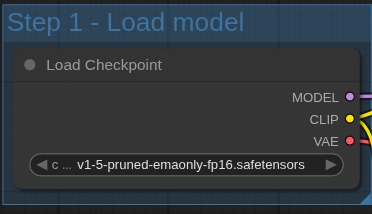

**Bloco:** `Load Checkpoint`

**Arquivo carregado:** `v1-5-pruned-emaonly-fp16.safetensors` que contém os pesos (weights) de toda a rede neural, ou seja, os parâmetros aprendidos durante o treinamento.

### Função:

Esse é o **ponto de partida** do pipeline — ele carrega os três componentes principais do Stable Diffusion:

1. **MODEL (UNet):**
   É o modelo de difusão em si, responsável por transformar ruído em uma imagem coerente. Ele aprende o processo de “denoising” progressivo durante a geração.
2. **CLIP (Transformer):**
   O codificador de texto. Ele transforma o prompt textual em um vetor numérico que representa o significado do texto (chamado *text embedding*).
3. **VAE (Variational Autoencoder):**
   O decodificador que converte o espaço latente (formato comprimido da imagem) em uma imagem RGB final.

---

## **Step 2 – Prompt**

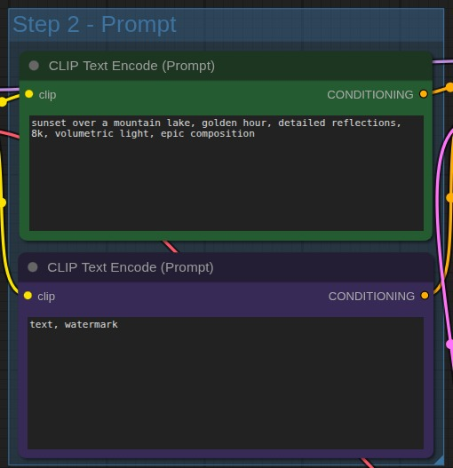

**Bloco 1:** `CLIP Text Encode (Prompt)`

**Bloco 2:** `CLIP Text Encode (Negative Prompt)`

### Função:

Esses dois blocos são os prompts que guiam a geração da imagem.

* O **Prompt Positivo** indica o que o modelo **deve gerar**: uma paisagem com pôr do sol sobre o lago, iluminação volumétrica, etc.
* O **Prompt Negativo** indica o que o modelo **deve evitar**, como artefatos, texto sobreposto, ou marcas d’água.

O **CLIP (Contrastive Language–Image Pre-training)** é a parte do modelo que associa conceitos visuais a palavras.
Ele transforma esses prompts em *condições* (COND ou CONDITIONING) que serão passadas ao gerador (KSampler) na etapa seguinte.

---

## **Step 3 – Image Size**

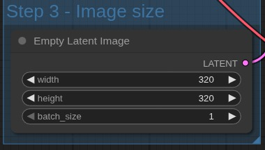

**Bloco:** `Empty Latent Image`

**Parâmetros:**

* `width = 320`
* `height = 320`
* `batch_size = 1`

### Função:

Esse nó cria uma **imagem latente vazia**, ou seja, um “mapa de ruído” inicial no espaço comprimido do modelo.
É a base sobre a qual o processo de difusão reversa vai atuar para “esculpir” a imagem.

O *Stable Diffusion* não trabalha diretamente no espaço de pixels (como 512x512 RGB), mas num **espaço latente reduzido**, tipicamente de 1/8 do tamanho original.

---

## **Step 4 – Sampling (Geração da Imagem)**

📗 **Bloco:** `KSampler`

### Função:

O **KSampler** é o núcleo do processo de geração.
Ele combina:

* o **modelo UNet** (do checkpoint),
* o **texto codificado** (prompts positivo e negativo),
* e o **ruído inicial** (da imagem latente vazia)

para **iterativamente refinar** o ruído e produzir uma imagem coerente.

### Parâmetros Principais:

- **seed**: Controla a aleatoriedade da geração (permite reproduzir resultados).
- **steps**: Número de iterações do processo de difusão.
- **cfg (Classifier-Free Guidance)**: Intensidade da aderência ao prompt (valores maiores forçam mais fidelidade).
- **sampler_name**: Método numérico usado na difusão (e.g. Euler, DDIM, DPM++).
- **scheduler**: Função que define como o ruído é removido ao longo das iterações.
- **denoise**: Intensidade do processo de “limpeza” (1.0 = total)

---

## **Step 5 – Output e Salvamento**

📗 **Bloco:** `VAE Decode`
📗 **Bloco:** `Save Image`

### 🔍 Função:

* **VAE Decode:**
  Converte a imagem latente (compacta) em uma imagem RGB de 320x320 pixels.
  É o processo inverso do *VAE Encoder*, utilizado durante o treinamento do modelo.

* **Save Image:**
  Salva o resultado final no diretório configurado, com prefixo `SD1.5`.

---

## Experimentos

A ideia aqui foi realizar diferentes testes com o mesmo prompt, variando alguns campos presentes no KSampler.

Os campos que permaneceram sem modificação durante todos os testes foram:

- **Negative Prompt**: "low quality, blurry"
- **Conrol after generate**: "randomize"

| # | Prompt | Seed | Steps | cfg | Sampler Name | Scheduler | denoise | Resultado (Imagem) |
|---|--------|-----------------|--------|----------|-----------|------|--------------------| ------ |
| 1 | "sunset over a mountain lake, golden hour, detailed reflections, 8k, volumetric light, epic composition" | 1113938508162727 | 20 | 8.0 | euler | normal | 1.0 |  | 
| 2 | "sunset over a mountain lake, golden hour, detailed reflections, 8k, volumetric light, epic composition" | 109748602718283 | 35 | 3.0 | euler | exponential | 1.0 |  | 
| 3 | "sunset over a mountain lake, golden hour, detailed reflections, 8k, volumetric light, epic composition" | 114792471731001 | 20 | 12.0 | euler | karras | 1.0 | 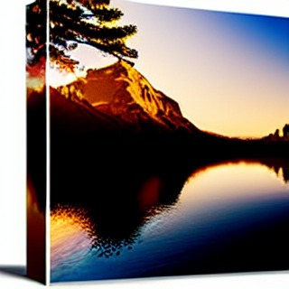 | 
| 4 | "sunset over a mountain lake, golden hour, detailed reflections, 8k, volumetric light, epic composition" | 79684128807079 | 20 | 8.0 | heun | normal | 0.5 | 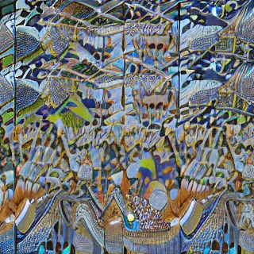 | 
| 5 | "sunset over a mountain lake, golden hour, detailed reflections, 8k, volumetric light, epic composition" | 435091414668787 | 20 | 5.0 | heun | exponential | 1.0 |  | 
---

## Análise das Iterações do Modelo *Text-to-Image*

#### **Iteração 1 → 2**

Da primeira para a segunda imagem, foi utilizado um número maior de *steps*, o que resultou em **maior detalhamento** na geração.
O parâmetro `cfg`, ajustado para **3.0**, aumentou a **criatividade do modelo**, permitindo que ele se distanciasse mais do prompt original.
Além disso, a mudança do `scheduler` para ***exponential*** trouxe **maior contraste** e definição à imagem final.

---

#### **Iteração 3**

Na terceira imagem, o resultado se **distanciou significativamente** das duas primeiras.
O `cfg` foi elevado para **12.0**, restringindo a criatividade do modelo e o forçando a seguir **estritamente o prompt** fornecido.
O uso do `scheduler` ***karras*** suavizou o resultado, gerando **cores mais pastéis** e uma aparência mais homogênea.
Essa combinação de parâmetros fez com que as cores se diferenciassem das versões anteriores, e a aparência de um **retângulo destacado** pode ter sido consequência da interpretação excessivamente rígida do prompt, que impediu correções posteriores durante a difusão.

---

#### **Iteração 4**

A quarta imagem foi a que mais **se afastou do resultado esperado**.
Foi utilizado um `cfg` intermediário e o `sampler name` ***heun***, cujo método realiza uma “previsão” seguida de uma “correção” a cada passo — o que, teoricamente, **deveria produzir imagens mais suaves e coerentes**, com **transições naturais**.
Entretanto, o resultado não refletiu esse comportamento, possivelmente devido ao valor de `denoise` em **0.5**, que reduziu a intensidade da reconstrução e comprometeu a coerência visual.

---

#### **Iteração 5**

Na quinta e última iteração, o valor de `cfg` foi **ligeiramente reduzido**, permitindo **mais liberdade criativa** ao modelo.
O `sampler name` permaneceu como ***heun***, porém o `scheduler` e o `denoise` foram alterados para ***exponential*** e **1.0**, respectivamente.
Essas mudanças resultaram em uma imagem final **mais próxima das primeiras iterações**, recuperando o equilíbrio entre **fidelidade ao prompt** e **qualidade visual**.

---

# Implementação 2 - Text to Audio

## Arquitetura e Pipeline

### 1. Componentes Principais

### **Load Checkpoint**

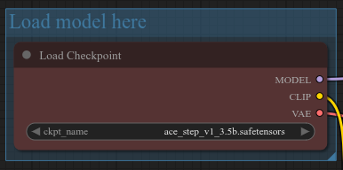

Carrega o modelo principal de difusão responsável por gerar o áudio.
Neste caso, o *checkpoint* utilizado é:
`ace_step_v1_3.5b.safetensors`.

* **Função:** Define os pesos do modelo neural que serão utilizados durante todo o processo de geração.
* **Saídas:**

  * `MODEL`: arquitetura principal de difusão;
  * `CLIP`: componente responsável pela interpretação textual (prompt);
  * `VAE`: módulo de codificação e decodificação do espaço latente.

---

### **Latent**

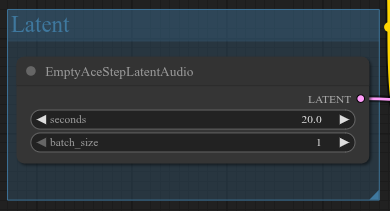

Cria o **espaço latente vazio** onde o áudio será gerado. É equivalente a definir a “tela em branco” antes do processo de difusão.

* **Parâmetros:**

  * `seconds`: duração desejada do áudio (20.0 s);
  * `batch_size`: número de amostras a serem geradas simultaneamente (1).

---

### **Adjust the Vocal Volume**

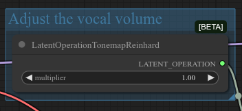

Esse nó aplica uma operação de *tone mapping* no espaço latente para **ajustar o volume ou intensidade das vozes** geradas.

* **Função:** Controla o equilíbrio tonal do áudio ainda no formato latente.
* **Parâmetro principal:**

  * `multiplier`: ajusta a intensidade geral (1.0 é neutro; valores maiores ampliam o volume percebido).

---

### **Prompt**

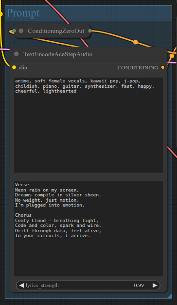

Bloco responsável por converter o **prompt textual** (descrição + letras da música) em vetores de condicionamento para o modelo.

* **Função:** Interpreta tanto os **descritores musicais** quanto as **letras da canção**, guiando a geração conforme o estilo e conteúdo indicados.

  **Verso e refrão** também foram incluídos no campo de texto, permitindo ao modelo gerar uma melodia coerente com as letras.
* **Parâmetro:**

  * `lyrics_strength`: controla o quanto o texto das letras influencia o resultado (0.99 → influência muito forte).

---
### Output

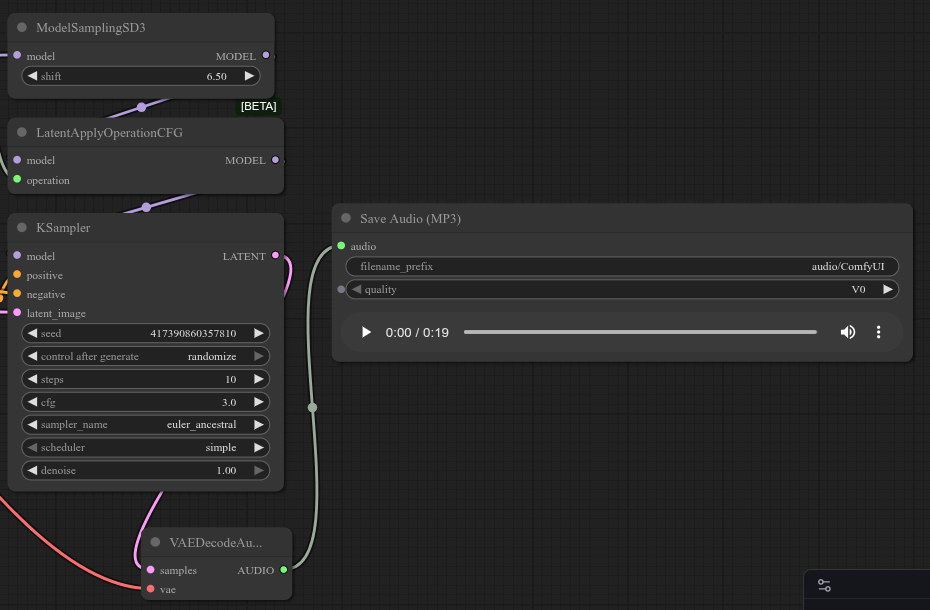

#### **ModelSamplingSD3**

Define a estratégia de amostragem e o deslocamento (`shift`) no espaço latente.

* **Função:** Controla o comportamento da difusão — um *shift* maior tende a gerar sons mais diversificados e criativos, enquanto valores menores produzem resultados mais previsíveis.

---

#### **LatentApplyOperationCFG**

Aplica o **Class-Free Guidance (CFG)** ao modelo.
Esse parâmetro ajusta o equilíbrio entre **fidelidade ao prompt** e **criatividade** do resultado.

* **Função:** Valores altos de `cfg` tornam o áudio mais fiel ao texto, enquanto valores menores aumentam a liberdade criativa.

---

#### **KSampler**

É o **núcleo do processo de difusão**, onde o áudio é efetivamente gerado a partir do espaço latente.

* **Parâmetros principais:**

  * `seed`: valor aleatório que define a reprodutibilidade da geração;
  * `steps`: número de iterações de difusão;
  * `cfg`: grau de aderência ao prompt;
  * `sampler_name`: método de amostragem;
  * `scheduler`: curva de difusão;
  * `denoise`: intensidade de reconstrução.

---

#### **VAEDecodeAudio**

Decodifica o **latente gerado** em **áudio real (forma de onda)**.
O VAE traduz o espaço comprimido do modelo para um som audível e com estrutura musical perceptível.

* **Função:** Converter o resultado numérico da difusão em um sinal de áudio contínuo.
* **Saída:** áudio pronto para exportação.

---

#### **Save Audio (MP3)**

Salva o resultado final no formato `.mp3`.

---

## Experimentos

### Configuração 1: 
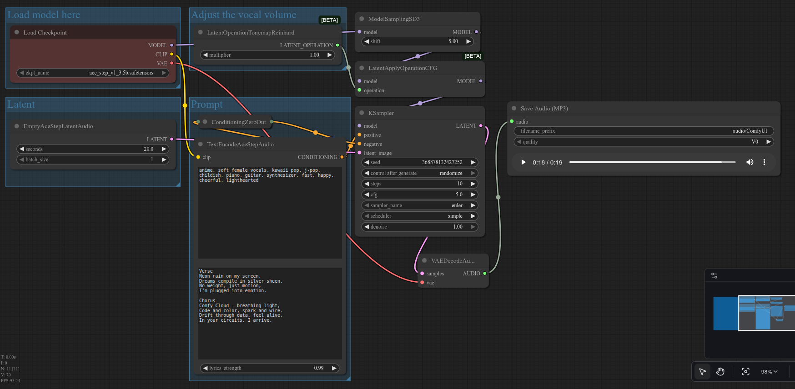

<audio controls>
  <source src="../audio/audio1.mp3" type="audio/mpeg">
</audio>

### Configuração 2: 

<audio controls>
  <source src="../audio/audio2.mp3" type="audio/mpeg">
</audio>

### Configuração 3: 

<audio controls>
  <source src="../audio/audio3.mp3" type="audio/mpeg">
</audio>

### Configuração 4: 

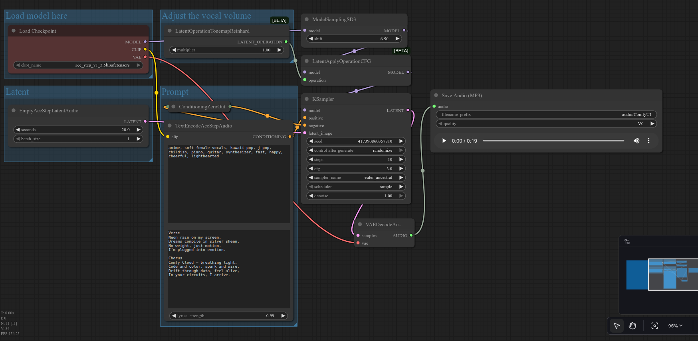

<audio controls>
  <source src="../audio/audio4.mp3" type="audio/mpeg">
</audio>

### Configuração 5: 

<audio controls>
  <source src="../audio/audio5.mp3" type="audio/mpeg">
</audio>

## Análise das Iterações do Modelo *Text-to-Audio*

#### **Iteração 1 → 2**

Na primeira geração, o áudio apresenta uma **voz excessivamente robótica** e **ausência quase total de melodia**, fazendo com que o resultado soe pouco musical.
Já na segunda iteração, a voz torna-se **mais suave e natural**, aproximando-se bastante de uma **voz humana real**. Além disso, percebe-se o surgimento de uma **melodia sutil**, mais condizente com a estrutura de uma canção.

Essas melhorias ocorreram principalmente devido à **alteração dos parâmetros `shift` e `cfg`**:

* O `shift` diminuído mais equilibrado tornou o modelo **mais previsível** no processo de *pré-sampling*, por estar **menos deslocado no espaço latente**.
* O `cfg` diminuído ajustado resultou em um **output mais suave**, com **menor rigidez em relação ao prompt textual**, o que favoreceu a fluidez da música.

---

#### **Iteração 3**

Nesta iteração, o objetivo foi alcançar um estilo **mais “acústico” e natural**.
Para isso, utilizou-se o `sampler` ***dpm***, conhecido por gerar **voz com maior fidelidade e clareza**, reduzindo efeitos artificiais como o *autotune*.
O `scheduler` foi configurado como ***karras***, que tende a produzir **áudios mais nítidos e detalhados**, evidenciando instrumentos como **batidas e acompanhamentos rítmicos**.

Contudo, o resultado apresentou novamente uma **voz mais robótica**, possivelmente devido à **interferência mútua** entre o *sampler* e o *scheduler*, que podem ter comprometido a suavidade esperada.

---

#### **Iteração 4**

Aqui, buscou-se gerar um **áudio mais experimental e criativo**, que **divergisse do prompt original**.
Para atingir esse objetivo:

* O `cfg` já é **baixo**, permitindo **maior liberdade criativa** e **menor rigidez** na relação com o texto;
* O `shift` foi **aumentado**, ampliando a **diversificação no espaço latente**;
* O `sampler_name` foi definido como ***euler ancestral***, que tende a produzir **resultados mais dinâmicos e orgânicos**;
* O `scheduler` foi ajustado para ***simple***, visando **maior equilíbrio geral**.

O resultado foi um **áudio mais “vivo” e expressivo**, com **voz mais natural** e **melodia mais impactante**, mostrando um equilíbrio interessante entre criatividade e coerência musical.

---

#### **Iteração 5**

Por fim, o objetivo desta iteração foi criar uma música **altamente fiel ao prompt**, com **mínima generalização e variação criativa**.
Para isso:

* O `cfg` foi **aumentado**, tornando o modelo **mais restrito e guiado**;
* O `shift` foi **diminuído**, reduzindo a exploração no espaço latente;
* O `sampler_name` retornou a ***euler*** e o `scheduler` permaneceu como ***simple***, assegurando **pouco espaço para interpretação criativa**.

Como consequência, o resultado foi um **áudio extremamente robótico e monótono**, com **quase nenhuma melodia**, evidenciando o excesso de restrição dos parâmetros e a falta de liberdade criativa do modelo.

